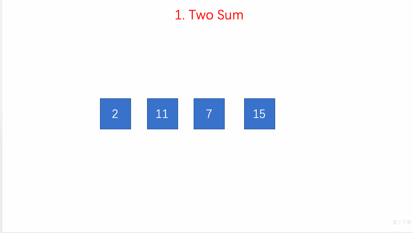

# LeetCode Problem No. 1: Sum of Two Numbers

> This article was first published on the public account "Illustrated Interview Algorithm" and is one of the series of articles [Illustrated LeetCode](<https://github.com/MisterBooo/LeetCodeAnimation>).
>
> Synchronized blog: https://www.algomooc.com
>

The question comes from question No. 1 on LeetCode: The sum of two numbers. The difficulty of the questions is Easy, and the current passing rate is 45.8%.

### Title description

Given an integer array `nums` and a target value `target`, please find the **two** integers in the array whose sum is the target value, and return their array subscripts.

You can assume that each input will correspond to only one answer. However, you cannot reuse the same elements in this array.

**Example:**

```
Given nums = [2, 7, 11, 15], target = 9

Because nums[0] + nums[1] = 2 + 7 = 9
So it returns [0, 1]
```

### Question analysis

Use a lookup table to solve this problem.

Set up a map container record to record the value and index of the element, and then traverse the array nums.

* Use the temporary variable complement each time it traverses to save the difference between the target value and the current value
* Search record in this traversal to see if there is a value consistent with complement. If the search is successful, return the index value of the search value and the value of the current variable i
* If not found, save the element and index value i in record

### Animation description



### Code implementation
#### C++
```
// 1. Two Sum
// https://leetcode.com/problems/two-sum/description/
// Time complexity: O(n)
// Space complexity: O(n)
class Solution {
public:
    vector<int> twoSum(vector<int>& nums, int target) {
        unordered_map<int,int> record;
        for(int i = 0 ; i < nums.size() ; i ++){
       
            int complement = target - nums[i];
            if(record.find(complement) != record.end()){
                int res[] = {i, record[complement]};
                return vector<int>(res, res + 2);
            }

            record[nums[i]] = i;
        }
        return {};
    }
};

```
#### C
```c
// 1. Two Sum
// https://leetcode.com/problems/two-sum/description/
// Time complexity: O(n)
// Space complexity: O(n)
/**
 * Note: The returned array must be malloced, assume caller calls free().
 */
int* twoSum(int* nums, int numsSize, int target, int* returnSize){
    int *ans=(int *)malloc(2 * sizeof(int));
    int i,j;
    bool flag=false; 
    for(i=0;i<numsSize-1;i++)
    {
        for(j=i+1;j<numsSize;j++)
        {
            if(nums[i]+nums[j] == target)
            {
                ans[0]=i;
                ans[1]=j;
                flag=true;
            }
        }
    }
    if(flag){
        *returnSize = 2;
    }
    else{
        *returnSize = 0;
    }
    return ans;
}
```
#### Java
```
// 1. Two Sum
// https://leetcode.com/problems/two-sum/description/
// Time complexity: O(n)
// Space complexity: O(n)
class Solution {
    public int[] twoSum(int[] nums, int target) {
        int l = nums.length;
        int[] ans=new int[2];
        int i,j;
        for(i=0;i<l-1;i++)
        {
            for(j=i+1;j<l;j++)
            {
                if(nums[i]+nums[j] == target)
                {
                    ans[0]=i;
                    ans[1]=j;
                }
            }
        }
        
        return ans;
        
    }
}
```
#### Python
```
# 1. Two Sum
# https://leetcode.com/problems/two-sum/description/
# Time complexity: O(n)
# Space complexity: O(n)
class Solution(object):
    def twoSum(self, nums, target):
        l = len(nums)
        print(nums)
        ans=[]
        for i in range(l-1):
            for j in range(i+1,l):
                if nums[i]+nums[j] == target:
                    ans.append(i)
                    ans.append(j)
                    print([i,j])
                    break
        return ans
  ```      


