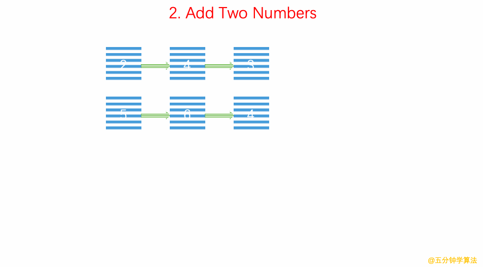

# LeetCode Problem No. 2: Adding Two Numbers

> This article was first published on the public account "Illustrated Interview Algorithm" and is one of the series of articles [Illustrated LeetCode](<https://github.com/MisterBooo/LeetCodeAnimation>).
>
> Synchronized blog: https://www.algomooc.com

The question comes from question No. 2 on LeetCode: Adding two numbers. The difficulty level of the questions is Medium, and the current pass rate is 33.9%.

### Title description

Given two **non-empty** linked lists representing two non-negative integers. Among them, their respective digits are stored in **reverse order**, and each of their nodes can only store **one** digit.

If, we add these two numbers, a new linked list will be returned representing their sum.

You can assume that neither number starts with 0 except for the number 0.

**Example:**

```
Input: (2 -> 4 -> 3) + (5 -> 6 -> 4)
Output: 7 -> 0 -> 8
Reason: 342 + 465 = 807
```

### Question analysis

Set up a variable `carried` that represents carry, create a new linked list, process the two input linked lists simultaneously from the beginning to the end, add each two, and add the value after `carried` to the result as a new node to the back of the new linked list.

### Animation description



### Code implementation

#### C++
```c++
/// Time complexity: O(n)
/// Space complexity: O(n)
/**
 * Definition for singly-linked list.
 * public class ListNode {
 *     int val;
 *     ListNode next;
 *     ListNode(int x) { val = x; }
 * }
 */
class Solution {
public:
    ListNode* addTwoNumbers(ListNode* l1, ListNode* l2) {

        ListNode *p1 = l1, *p2 = l2;
        ListNode *dummyHead = new ListNode(-1);
        ListNode* cur = dummyHead;
        int carried = 0;
        while(p1 || p2 ){
            int a = p1 ? p1->val : 0;
            int b = p2 ? p2->val : 0;
            cur->next = new ListNode((a + b + carried) % 10);
            carried = (a + b + carried) / 10;

            cur = cur->next;
            p1 = p1 ? p1->next : NULL;
            p2 = p2 ? p2->next : NULL;
        }

        cur->next = carried ? new ListNode(1) : NULL;
        ListNode* ret = dummyHead->next;
        delete dummyHead;
        return ret;
    }
};

```
#### Java
```java
class Solution {
    public ListNode addTwoNumbers(ListNode l1, ListNode l2) {
        ListNode dummyHead = new ListNode(0);
        ListNode cur = dummyHead;
        int carry = 0;

        while(l1 != null || l2 != null)
        {
            int sum = carry;
            if(l1 != null)
            {
                sum += l1.val;
                l1 = l1.next;
            }
            if(l2 != null)
            {
                sum += l2.val;
                l2 = l2.next;
            }
            //Create new node
            carry = sum / 10;
            cur.next = new ListNode(sum % 10);
            cur = cur.next;
    
        }
        if (carry > 0) {
            cur.next = new ListNode(carry);
        }
        return dummyHead.next;
    }
}
```
#### Python
```python
class Solution(object):
    def addTwoNumbers(self, l1, l2):
        res=ListNode(0)
        head=res
        carry=0
        while l1 or l2 or carry!=0:
            sum=carry
            if l1:
                sum+=l1.val
                l1=l1.next
            if l2:
                sum+=l2.val
                l2=l2.next
            # set value
            if sum<=9:
                res.val=sum
                carry=0
            else:
                res.val=sum%10
                carry=sum//10
            # creat new node
            if l1 or l2 or carry!=0:
                res.next=ListNode(0)
                res=res.next
        return head
```


