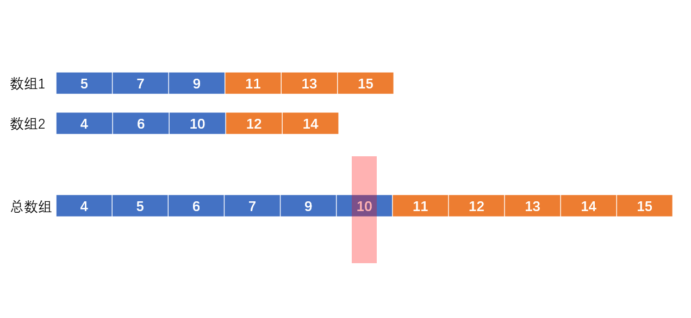
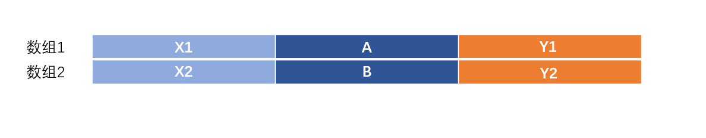
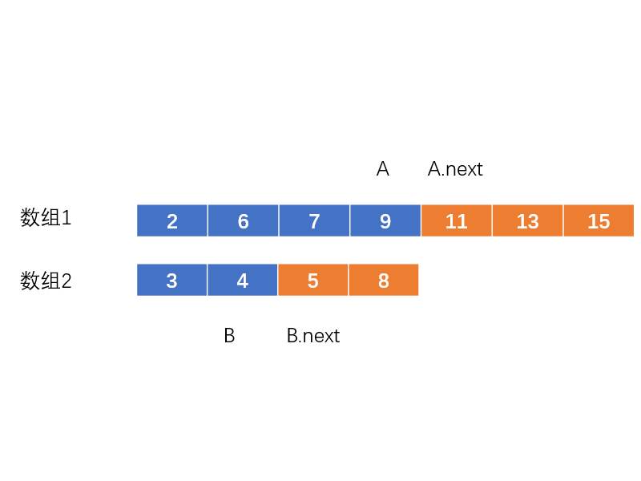
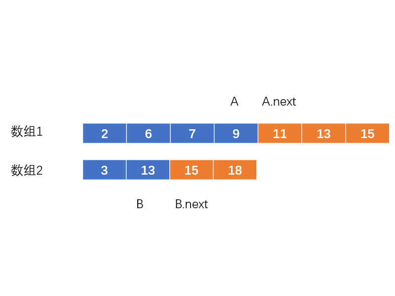
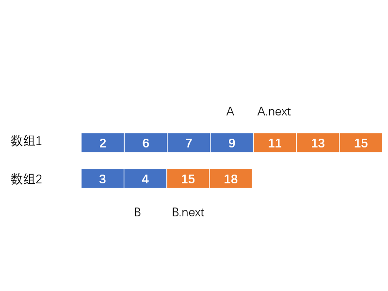
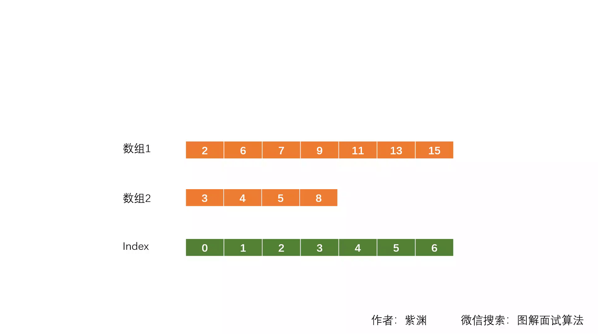

# LeetCode Problem No. 4: Finding the median of two positive arrays

> This article was first published on the public account "Illustrated Interview Algorithm" and is one of the series of articles [Illustrated LeetCode](<https://github.com/MisterBooo/LeetCodeAnimation>).
>
> Synchronized blog: https://www.algomooc.com

The question comes from question No. 4 on LeetCode: Find the median of two positive-order arrays. The difficulty of the questions is Hard, and the current passing rate is 29.0%.

#### Title description

> Given two positive-order (from small to large) arrays nums1 and nums2 of size m and n.
Please find the median of these two positive-order arrays, and the time complexity of the algorithm is required to be O(log(m + n)).
You can assume that nums1 and nums2 will not be empty at the same time.

```java
Example 1:
nums1 = [1, 3]
nums2 = [2]
    
Then the median is 2.0
    
Example 2:
nums1 = [1, 2]
nums2 = [3, 4]
    
Then the median is (2 + 3)/2 = 2.5
```

#### Question analysis
The analysis of this question on the Internet is very "advanced" and difficult to understand. I think they all complicate simple problems. This question does have some troubles in some processing, such as the processing of array boundaries and the processing of the median of an even number. But its core idea is not complicated.

First, we can only consider the case where the total number of numbers is an odd number. Let’s take a look at the image below:



The blue box is the number to the left of the median (including the median), while the orange box is the number to the right of the median.

3 obvious rules:
1. The total number of blue boxes in the two arrays = (the total number of numbers + 1)/2;
2. All the numbers in the blue box are smaller than the numbers in the orange box
3. The median is the largest digit in the blue box (i.e. the last digit in the blue box in array 1, or the last digit in the blue box in array 2)

As shown in the figure, we need to find a set of A and B that satisfies the above three rules.
For rule 1, we find any A in array 1, and then according to rule 1, we can calculate the position of the corresponding B.
For rule 2, since arrays 1 and 2 are both ordered arrays, that is, X1<A<Y1; X2<B<Y2. We actually only need to determine whether A is less than Y2, and whether B is less than Y1.
For rule 3, since arrays 1 and 2 are both ordered arrays, the median is the larger item between A and B.

So how exactly does it work?
Since arrays 1 and 2 are both ordered arrays, and the question requires O(log(m+n)) complexity, we should obviously consider the dichotomy method.

**Case 1:**



First, we select array 1 for operation. Take its middle value 9. (So ​​A=9) According to rule 1, we find the corresponding value (B = 4) in array 2. (There are 11 numbers in total, (11+1) / 2 = 6, so the total number of blue boxes is 6)
Next, we determine whether A(9) is less than B.next(5) and whether B(4) is less than A.next(11) according to rule 2.
Obviously, A is larger than B.next, which is an orange box. This is not allowed. It can be seen that A can only take a smaller number than 9. If we take a larger number, then B will be smaller and less likely to satisfy rule 2. So in this case we're going to bisect to the left.

**Case 2:**



In this case, B is larger than A.next, which is an orange box. This is not allowed. It can be seen that A can only take a number larger than 9. If you take a smaller number, then B will be larger, and it is even less likely to satisfy rule 2. So in this case we're going to bisect to the right.

**Case 3:**



As we continue to bisect, the median is obviously bound to emerge.
As shown in the figure, A is less than B.next, and B is less than A.next.
Then, obviously, the larger of A and B is the median (Rule 3).

The core idea of ​​the algorithm for this question is so simple. In addition, when the total number of numbers is an even number, we need to add the "median" we found to its next item and divide by 2. Since the numbers in this question may be the same, >= and <= need to be used to compare sizes.
A code from the author is provided below. The results on leetcode are: execution time: 2 ms; memory consumption: 40.3 MB, both exceeding 100% of users. Readers can refer to it.


#### Code implementation

Java language

```java
public class Solution {
  public double findMedianSortedArrays(int[] nums1, int[] nums2) {
    // Making nums1 a shorter array can not only improve the retrieval speed, but also avoid some boundary problems
    if (nums1.length > nums2.length) {
      int[] temp = nums1;
      nums1 = nums2;
      nums2 = temp;
    }

    int len1 = nums1.length;
    int len2 = nums2.length;
    int leftLen = (len1 + len2 + 1) / 2; //The length of the left half after merging and sorting the two arrays
    
    // Perform binary search on array 1
    int start = 0;
    int end = len1;
    while (start <= end) {
      //The positions of the measured numbers A and B in the two arrays (calculated from 1)
      // count1 = 2 represents the second number of the num1 array
      // 1 greater than index
      int count1 = start + ((end - start) / 2);
      int count2 = leftLen - count1;
      
      if (count1 > 0 && nums1[count1 - 1] > nums2[count2]) {
        //A's next is larger than B's next
        end = count1 - 1;
      } else if (count1 < len1 && nums2[count2 - 1] > nums1[count1]) {
        // B is bigger than A's next
        start = count1 + 1;
      } else {
        // Get the median
        int result = (count1 == 0)? nums2[count2 - 1]: // When the numbers in the num1 array are all on the right side of the total array
                      (count2 == 0)? nums1[count1 - 1]: // When the numbers in the num2 array are all on the right side of the total array
                      Math.max(nums1[count1 - 1], nums2[count2 - 1]); // Compare A and B
        if (isOdd(len1 + len2)) {
          return result;
        }

        // Handle the case of even numbers
        int nextValue = (count1 == len1) ? nums2[count2]:
                        (count2 == len2) ? nums1[count1]:
                        Math.min(nums1[count1], nums2[count2]);
        return (result + nextValue) / 2.0;
      }
    }

    return Integer.MIN_VALUE; // Definitely won't get here
  }

  // Odd numbers return true, even numbers return false
  private boolean isOdd(int x) {
    return (x & 1) == 1;
  }
}
```

#### Animation understanding



#### Complexity analysis

+ Time complexity: Binary search on the array, so O(logN)
+ Space complexity: O(1)


