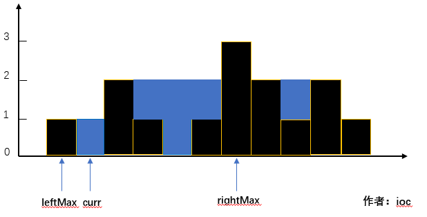
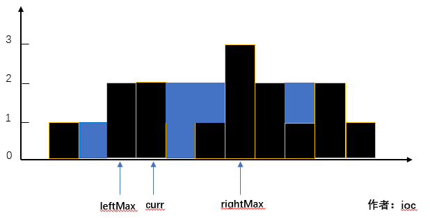
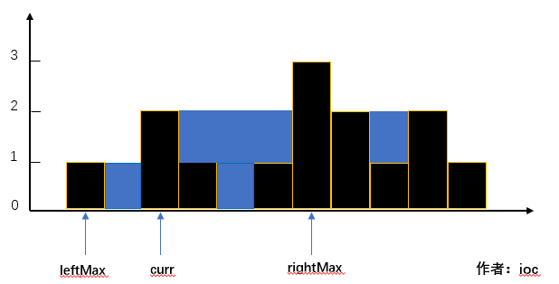

## LeetCode Question No. 42: Catching Rainwater

> This article was first published on the public account "Illustrated Interview Algorithm" and is one of the series of articles [Illustrated LeetCode](<https://github.com/MisterBooo/LeetCodeAnimation>).
>
> Personal blog: www.zhangxiaoshuai.fun

**This question chooses question 42 in leetcode, hard level, the current pass rate is 50.8%#**

### Title description:

```txt
Given n non-negative integers representing the height of each column with a width of 1, calculate how much rainwater the columns arranged in this way can catch after it rains.
Example:
Input: [0,1,0,2,1,0,1,3,2,1,2,1]
Output: 6
```


### Question analysis:

By definition, the capacity of a "trough" to store rainwater depends on the columns before and after it.

### Solution 1:

If you think about it carefully, this is actually similar to the barrel principle. For each pillar, we need to look forward and backward to find the highest pillar in front of the current pillar and the highest pillar behind it.

Here are **three situations** we need to understand:

- **The current pillar is smaller than the shortest of the two pillars**
  

  **The rainwater capacity that can be stored at the current location = leftMax - curr = 1**

  
  
- **The current pillar is equal to the shortest of the two pillars**
  

  **The rainwater capacity that can be stored at the current location is 0**

  

- **The current pillar is larger than the shortest of the two pillars**

  **Because curr < leftMax, rainwater cannot be stored at the current location**

**GIF animation demo:**


### Code:

```java
public int trap02(int[] height) { 
    int sum = 0;   
    //The columns at the two ends don't need to be considered, because there will definitely be no water. So the subscripts go from 1 to length - 2
    for (int i = 1; i < height.length - 1; i++) { 
        int max_left = 0;       
        //Find the highest value on the left
        for (int j = i - 1; j >= 0; j--) {  
            if (height[j] > max_left) {  
                max_left = height[j];  
            }       
        }        
        int max_right = 0;       
        //Find the highest on the right
        for (int j = i + 1; j < height.length; j++) { 
            if (height[j] > max_right) {  
                max_right = height[j];   
            }       
        }       
        //Find the smaller one at both ends
        int min = Math.min(max_left, max_right); 
        //Only if the smaller section is greater than the height of the current column, there will be water. In other cases, there will be no water.
        if (min > height[i]) { 
            sum = sum + (min - height[i]);       
        }   
    }   
    return sum;
}
```

It can be seen that the time complexity of the above method reaches **O(n^2)**

**So is there a better way to solve this problem? **

The following method cleverly uses **double pointers** to solve the problem:

The idea is roughly the same as the above solution, which is to individually calculate the capacity of the current wall to store rainwater; this solution is also very clever. I came across it when browsing the problem solving area. The boss also made a video (the link is at the end of the article), which explains it very clearly. I will use my own ideas to make a text description:

Since we are using the idea of ​​**twoPointers**, we need to start from the front and end of the array respectively. These two pointers do not affect each other and go their own way. But how to determine how much rainwater can be stored in the place where the current pointer passes?

At this time, we need two baffles **leftMax** and **rightMax**. These two baffles initially block the outermost wall. As the two pointers move forward, **leftMax** represents the highest wall along the path that **left** has walked. The same applies to **rightMax**.

**So how to calculate the amount of rain? **

Compare the heights of the left and right baffles, and then calculate based on the respective pointers of the two baffles.

- If the height of the left baffle is less than the height of the right baffle, then the amount of rainwater before the left pointer depends on the relationship between **leftMax** and height[left]. If the former is greater than the latter, then the capacity is equal to the former minus the latter; otherwise, the capacity is 0 (refer to the picture in Solution 1 to understand)
- If the height of the left baffle is greater than or equal to the height of the right baffle, it is basically the same as the previous situation, except that the amount of rainwater on the right is calculated.
- After each movement of the pointer, we want to update the bezel to its maximum value.

**In fact, the principle is relatively simple. To look at the whole problem with macroscopic thinking, at least ensure the height of the walls on both sides (two baffles), and then go to the issue of how much rainwater can be stored between each wall. (Find the amount of rainwater that can be stored between the highest baffle updated each time and the wall pointed by the pointer)**

### Code:

```java
public int trap(int[] height) {
    if (height.length == 0) return 0;
    int left = 0;
    int right = height.length-1;
    int leftMax = 0;
    int rightMax = 0;
    int result = 0;
    while (left <= right) {
      if (leftMax < rightMax) {
        result += leftMax - height[left] > 0 ?
            leftMax - height[left] : 0;
        leftMax = Math.max(leftMax, height[left]);
        left++;
      } else {
        result += rightMax - height[right] > 0 ?
            rightMax - height[right] : 0;
        rightMax = Math.max(rightMax, height[right]);
        right--;
      }
    }
    return result;
  }
```

**Time complexity: O(n) Space complexity: O(1)**

[leetcode supporting video entrance](https://leetcode-cn.com/problems/trapping-rain-water/solution/javashi-pin-jiang-jie-xi-lie-trapping-rain-water-b/)

