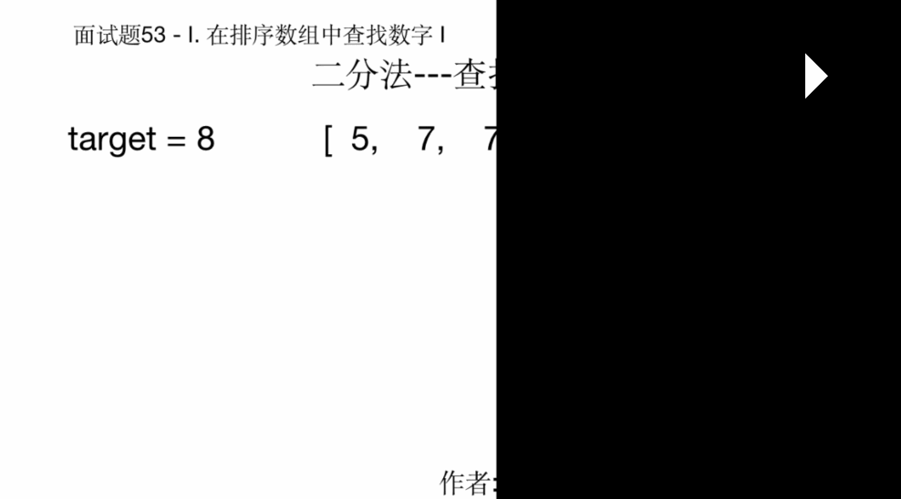

# Interview question 53 - I. Find numbers in sorted array I

> This article was first published on the public account "Illustrated Interview Algorithm" and is one of the series of articles [Illustrated LeetCode](<https://github.com/MisterBooo/LeetCodeAnimation>).
>
> Synchronized blog: https://www.algomooc.com

The question comes from interview question 53 on LeetCode - I. Finding numbers in a sorted array I. is an introductory question to algorithms.

## Title

Count the number of times a number appears in a sorted array.


Example 1:

```
Input: nums = [5,7,7,8,8,10], target = 8
Output: 2
```

Example 2:


```
Input: nums = [5,7,7,8,8,10], target = 6
Output: 0
```


limit:

```
0 <= array length <= 50000
```


## Idea analysis

### Violent cycle method

The question seems to be very simple. It is to find the number of times a target number appears in an array. Regardless of whether the array is ordered or unordered, one method we can use is the violent loop method.

#### Ideas

Define a count to record the number of times the target value appears. The initial value is 0, then traverse the array, and then if the current value is consistent with the target value, then the count is increased by one, and finally the count is returned. The time complexity of this solution is O(N)

#### Code implementation


```javaScript
/**
 * @param {number[]} nums
 * @param {number} target
 * @return {number}
 */
var search = function(nums, target) {
    let count = 0;
    for(let i of nums) {
    	if (i === target) {
    		count++
    	}
    }
    return count
};
```

### Improved Violence Cycle

#### Ideas

Because the array has been sorted, we actually don't need to traverse the entire array. We can use double pointers to traverse simultaneously from the head and tail respectively, then find the position of the left and right boundaries of the target value, and then calculate the count. In fact, it means that the number of occurrences of the target value is less than that of full traversal, and its algorithm complexity is still O(n)

	count = index of the right border - index of the left border + 1

#### Code implementation


```javaScript
/**
 * @param {number[]} nums
 * @param {number} target
 * @return {number}
 */
var search = function(nums, target) {
    let [left,  right] = [0, nums.length - 1]
    while(left <= right && (nums[left] !== target || nums[right] !== target)) {
    	if (left === right && nums[left] !== target) {
    		return 0;
    	}else if (nums[left] !== target) {
    		left++;
    	}else if (nums[right] !== target){
    		right--;
    	}
    }
    return right - left + 1;
};
```

### Dichotomy

#### Ideas

In addition to traversal, another method we can use to find values ​​in a sorted array is the dichotomy method. The idea is still the same as the improved brute force loop method, first find the left and right boundaries, and then do the calculation. The time complexity is O(logn)

#### Code implementation

```javaScript
/**
 * @param {number[]} nums
 * @param {number} target
 * @return {number}
 */
var search = function(nums, target) {
    let start = 0;
    let mid = 0;
    let end =  nums.length - 1;
    let left = 0;
    let right = 0;
  	// Find the right border
    while(start <= end) {
        mid = Math.ceil((start + end) / 2)
        if (nums[mid] <= target) {
            start = mid + 1
        } else {
            end = mid -1
        }
    }
    right = start - 1; // right border
  	// Find the left border
    start = 0;
    mid = 0; 
    end =  nums.length - 1;
    while(start <= end) {
        mid = Math.ceil((start + end) / 2)
        if (nums[mid] < target) {
            start = mid + 1
        } else {
            end = mid -1
        }
    }
    left = end + 1
    return right - left + 1
};
```

## Animation understanding




  