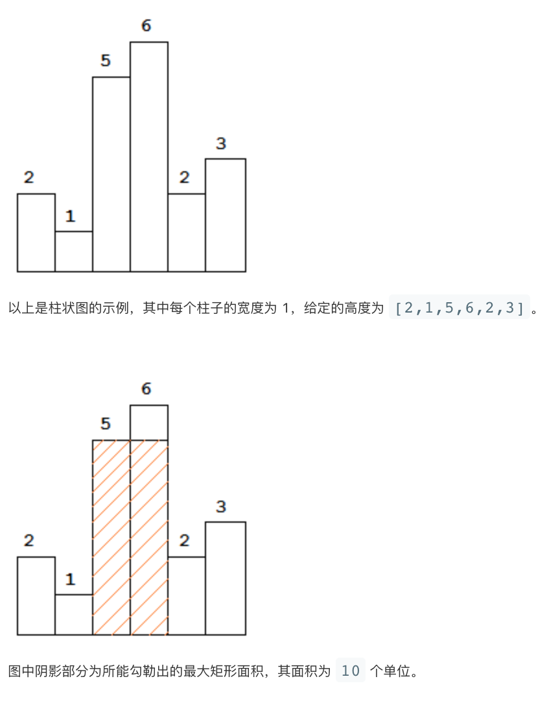

# LeetCode Problem No. 84: Maximum Rectangle in Histogram

> This article was first published on the public account "Illustrated Interview Algorithm" and is one of the series of articles [Illustrated LeetCode](<https://github.com/MisterBooo/LeetCodeAnimation>).
>
> Synchronized blog: https://www.algomooc.com

The question comes from question No. 84 on LeetCode: Maximum rectangle in a histogram. The difficulty of the questions is Hard, and the current passing rate is 39.2%.


<br>


### Title description

Given n non-negative integers, represent the height of each column in the histogram. Each column is adjacent to each other and has width 1 .

Find the maximum area of ​​the rectangle that can be drawn in this histogram.

**Example 1:**




<br>

### Question analysis

Given a bar chart, you are asked to find the rectangle with the largest area. The height of each position in the bar chart is not fixed, but the width is 1. Because the direction and size of the rectangle are uncertain, the idea is not obvious when looking at it intuitively, but one thing is very clear. The rectangle formed by a section is always related to the shortest height. Let's take a look at the example given in the question:

```
[2,1,5,6,2,3]

We assume that the rectangle can be determined by an interval [start, end],
Then the height of the rectangle in this interval is actually determined by the minimum value of this interval.

The height of the rectangle in the interval [0,1] is 1, and the area is 1 * 2 = 2
The height of the rectangle in the interval [2,3] is 5, and the area is 5 * 2 = 10
The height of the rectangle in the interval [0,5] is 1, and the area is 1 * 6 = 6
The height of the rectangle in the interval [2,5] is 2, and the area is 2 * 4 = 8
...
```

If you understand the above example, the idea for this question is there, that is, "**Find all intervals (subarrays) of the array. The value of the smallest element in the interval * The length of the interval is the area of ​​the rectangle represented by the current interval. Just find the rectangle with the largest area among all intervals**". This idea is very straightforward. In this way, the time complexity of finding all sub-arrays of the array is O(n^2). Is there any way to optimize it?

The above solution seems to be a violent solution intuitively, because we are constantly looking for subarrays, and there are actually a lot of repeated calculations. For example, the same example just now:
```
[2,1,5,6,2,3]

[2,1,5,6,2] We traverse it once, get the minimum value of the height of the matrix, and then find the area
[1,2,6,2] We then traverse it again to get the minimum value of the height of the matrix, and then find the area

When finding the second interval, we did not learn from the answer of the first interval at all, and there was double calculation.
```

At this time, we may need to change the way we look at this problem. From the above analysis, we have learned that the height of the matrix comes from the values ​​of the elements in the array. We can think about "**If the element at the current position is used as the height of the rectangle, how many positions can it extend to the left and right at most**", for example:

```
[2,1,5,6,2,3]

If we take the 2nd element in the array, which is 1, as the height of the matrix
It can extend to 2 to the left and 3 to the right, so the area is 1 * 6 = 6

If we take the 5th element in the array, which is 2, as the height of the matrix
It can extend to 5 to the left and 3 to the right, so the area is 2 * 4 = 8

If we take the 3rd element in the array, which is 5, as the height of the matrix
It can extend to 5 (itself) to the left and 6 to the right, so the area is 5 * 2 = 10

...
```

Okay, now that the idea analysis is over, how to implement such an idea now? We need to determine the left and right boundaries that an element can extend to. This may not be easy for you to understand. In other words, we actually need to find "**The location of the first element on the left that is smaller than the current element, and the location of the first element on the right that is smaller than the current element**". Let's look at an example:

```
[2,1,5,6,2,3]

The second element of the array is 1. There is no element smaller than it on the left and right, so the interval determined by it is the entire array.

The fifth element of the array is 2, the first element on the left that is smaller than it is 1, and the first element on the right that is smaller than it is -1 (meaning none)
Therefore, the interval it determines is [2, 5]

The third element of the array is 5, the first element on the left that is smaller than it is 1, and the first element on the right that is smaller than it is 6
Therefore, the interval it determines is [2, 3]

...
```

In the implementation, we need to use the data structure of the stack. The values ​​corresponding to the elements stored in the stack are monotonically increasing. This ensures that the array is traversed from left to right. The previous element pushed onto the stack is the left boundary of the next element pushed onto the stack. In addition, if the next element to be pushed onto the stack is smaller than the value of the element on the top of the stack, it means that the right boundary of the element on the top of the stack has been found, and both the left and right boundaries have been found. The top element of the stack is popped out for calculation. In this way, an element will only be pushed into the stack once and popped out once, so the time complexity is O(2 * n), which is O(n)

**Monotonic stack** This data structure is widely used. If you find that the question requires an element in the array to extend to the left and right sides to determine the interval, and the extension condition is related to the value of the element, then you can consider using a monotonic stack.

<br>

### Code implementation (brute force solution)

```java
public int largestRectangleArea(int[] heights) {
    if (heights == null || heights.length == 0) {
        return 0;
    }
    
    int n = heights.length;
    int result = 0;
    
    for (int i = 0; i < n; ++i) {
        int curMin = heights[i];
        
        for (int j = i; j < n; ++j) {
            curMin = Math.min(curMin, heights[j]);
            result = Math.max(result, (j - i + 1) * curMin);
        }
    }
    
    return result;
}
```

<br>

### Code implementation (monotone stack)

```java
public int largestRectangleArea(int[] heights) {
    if (heights == null || heights.length == 0) {
        return 0;
    }

    int n = heights.length;
    
    Stack<Integer> stack = new Stack<>();
    
    int result = 0;
    
    for (int i = 0; i <= n; ++i) {
        // curElement represents the value of the current element, and -1 represents the end of the array
        int curElement = (i == n) ? -1 : heights[i];
        
        // The pop operation of the element indicates that the current top element of the stack has found the right boundary
        // In addition, the elements stored in the stack are monotonically increasing, so the left boundary is also found.
        //While, just calculate the area of ​​the rectangle with the height of the top element of the stack.
        while (!stack.isEmpty() && heights[stack.peek()] >= curElement) {
            int high = heights[stack.pop()];
            int width = stack.isEmpty() ? i : i - stack.peek() - 1;
            
            result = Math.max(result, high * width);
        }
        
        stack.push(i);
    }
    
    return result;
}
```

<br>

### Animation description


<br>

### Complexity analysis

The time complexity of the brute force solution is `O(n^2)`, which is not difficult to see from the above description. In the code implementation of the monotonic stack, you may think that there are two nested loops here, so the time complexity is `O(n^2)`, but this is not the case. To consider the time complexity, it is not enough to just look at the form of the code. You can think about it this way, because each element in the array is only pushed into the stack once and popped out once, so the correct time complexity is `O(2n)`, ignoring the constant term, that is `O(n)`, the stack is used in the solution of monotonic stack, so the space complexity is `O(n)`.

<br>

