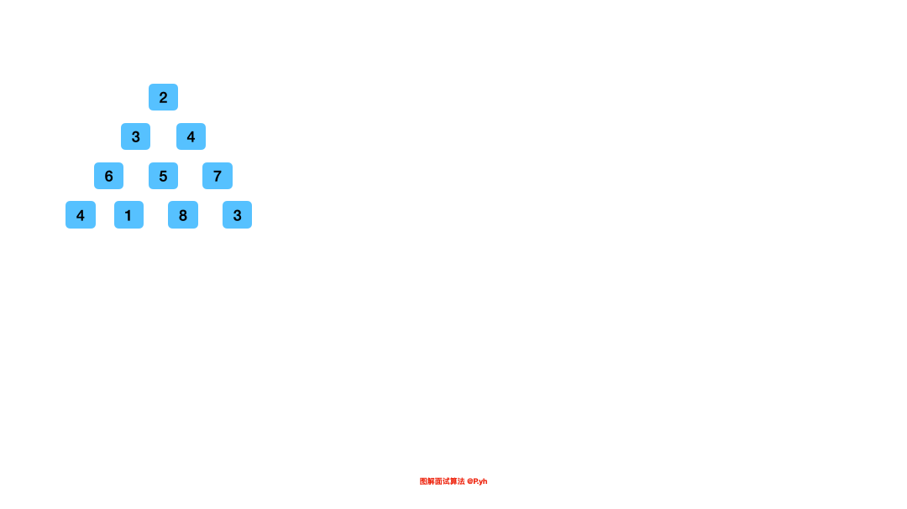

# LeetCode Problem No. 120: Triangle Minimum Path Sum

> This article was first published on the public account "Illustrated Interview Algorithm" and is one of the series of articles [Illustrated LeetCode](<https://github.com/MisterBooo/LeetCodeAnimation>).
>
> Synchronized blog: https://www.algomooc.com

The question comes from question No. 120 on LeetCode: Minimum path sum of triangles. The difficulty level of the questions is Medium, and the current pass rate is 64.7%.


<br>


### Title description

Given a triangle, find the minimum sum of paths from top to bottom. Each step can only move to the adjacent node in the next row.

Adjacent nodes here refer to two nodes whose subscript is the same as the subscript of the previous layer node or equal to the subscript of the previous layer node + 1.


**Example 1:**

```
[
     [2],
    [3,4],
   [6,5,7],
  [4,1,8,3]
]
```
The minimum path sum from top to bottom is 11 (that is, 2 + 3 + 5 + 1 = 11).

**illustrate:**

If you can solve this problem using only O(n) extra space (n is the total number of rows of the triangle), then your algorithm will be a plus.

<br>

### Question analysis

Given a triangle array, we need to find the minimum path sum from top to bottom. After confirming that this problem can be solved by dynamic programming, we can analyze it in four steps:

* Problem breakdown:
  
  The overall problem here is to find the minimum path sum. The path is the focus of the analysis here. The path is composed of elements. The element at the `[i][j]` position. The path passing through this element will definitely pass through `[i - 1][j]` or `[i - 1][j - 1]`. Therefore, the path sum passing through an element can be obtained by the path sum of one or two elements above this element.
  
* Status definition
  
  The definition of the state is generally linked to the answer to the problem. There are actually two ways here. One is to consider the path from top to bottom, and the other is to consider the path from bottom to top. Because the value of the element is unchanged, different directions of the path will not affect the final path sum. If it is from top to bottom, you will find that when considering the following elements, the path of the starting element will only be obtained from [i - 1][j], and the path of the last element in each row will only be obtained from [i - 1][j - 1] can be obtained. Both of them can be obtained. This is not easy to implement. Therefore, the bottom-up approach is considered here. The definition of the state becomes "**The minimum path from the last row element to the current element**". For the element [0][0], the final state represents our final answer.

* Recursion equation

  In "State Definition" we have already defined the state, and the recursion equation comes out.
  ```
  dp[i][j] = Math.min(dp[i + 1][j], dp[i + 1][j + 1]) + triangle[i][j]
  ```
  
* accomplish
  
  When initializing here, we need to fill the elements of the last row into the status array, and then calculate from bottom to top according to the strategy analyzed earlier.

There is a small space for optimization here, that is, every time we update the state (dp) array, it is based on the previous results. We do not need to know the previous results, and there is no mutual influence between parallel states, so we only need to open a one-dimensional array.

<br>

### Code implementation (before space optimization)

```java
public int minimumTotal(List<List<Integer>> triangle) {
    int n = triangle.size();
    
    int[][] dp = new int[n][n];
    
    List<Integer> lastRow = triangle.get(n - 1);
    
    for (int i = 0; i < n; ++i) {
        dp[n - 1][i] = lastRow.get(i);
    }
    
    for (int i = n - 2; i >= 0; --i) {
        List<Integer> row = triangle.get(i);
        for (int j = 0; j < i + 1; ++j) {
            dp[i][j] = Math.min(dp[i + 1][j], dp[i + 1][j + 1]) + row.get(j);
        }
    }
    
    return dp[0][0];
}
```

<br>

### Code implementation (after space optimization)
```java
public int minimumTotal(List<List<Integer>> triangle) {
    int n = triangle.size();
    
    int[] dp = new int[n];

    List<Integer> lastRow = triangle.get(n - 1);

    for (int i = 0; i < n; ++i) {
        dp[i] = lastRow.get(i);
    }

    for (int i = n - 2; i >= 0; --i) {
        List<Integer> row = triangle.get(i);
        for (int j = 0; j < i + 1; ++j) {       // i + 1 == row.size()
            dp[j] = Math.min(dp[j], dp[j + 1]) + row.get(j);
        }
    }

    return dp[0];
}
```

<br>

### Animation description



<br>

### Complexity analysis

The space and time complexity are both clear from the code, we have to iterate over every element in the triangle. The time complexity is `O(1 + 2 + ... + n)`, which is `O(n^2)`. The space complexity is optimized to be `O(n)`.

