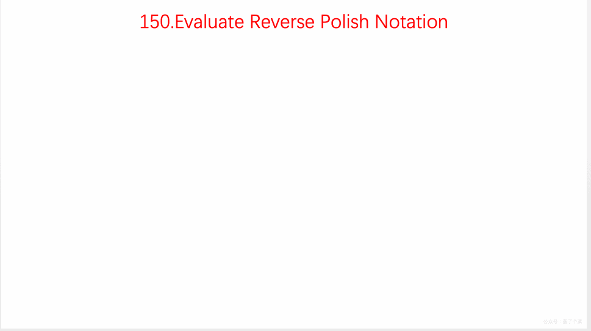

# LeetCode Issue No. 150: Evaluating reverse Polish expressions

> This article was first published on the public account "Illustrated Interview Algorithm" and is one of the series of articles [Illustrated LeetCode](<https://github.com/MisterBooo/LeetCodeAnimation>).
>
> Synchronized blog: https://www.algomooc.com

The question comes from question No. 150 on LeetCode: Evaluating reverse Polish expressions. The difficulty level of the questions is Medium, and the current pass rate is 43.7%.

### Title description

According to [Reverse Polish notation](https://baike.baidu.com/item/%E9%80%86%E6%B3%A2%E5%85%B0%E5%BC%8F/128437), find the value of the expression.

Valid operators include `+`, `-`, `*`, `/`. Each operand can be an integer or another reverse Polish expression.

**illustrate:**

- Integer division retains only the integer part.
- The given reverse Polish expression is always valid. In other words, the expression always evaluates to a valid value and there is no divisor by zero.

**Example 1:**

```
Input: ["2", "1", "+", "3", "*"]
Output: 9
Explanation: ((2 + 1) * 3) = 9
```

**Example 2:**

```
Input: ["4", "13", "5", "/", "+"]
Output: 6
Explanation: (4 + (13 / 5)) = 6
```

**Example 3:**

```
Input: ["10", "6", "9", "3", "+", "-11", "*", "/", "*", "17", "+", "5", "+"]
Output: 22
explain:
  ((10 * (6 / ((9 + 3) * -11))) + 17) + 5
= ((10 * (6 / (12 * -11))) + 17) + 5
= ((10 * (6 / -132)) + 17) + 5
= ((10 * 0) + 17) + 5
= (0 + 17) + 5
= 17 + 5
= 22
```

### Question analysis

Use the data structure `stack` to solve this problem.

- Traverse the array from front to back
- When a number is encountered, push it onto the stack
- When a symbol is encountered, the two numbers on the top of the stack are taken out for operation, and the result is pushed onto the stack.
- Traverse the entire array, the number on the top of the stack is the final answer

### Animation description



### Code implementation

```
class Solution {
public:
    int evalRPN(vector<string>& tokens) {

        stack<int> nums;
        stack<char> ops;
        for(const string& s: tokens){
            if(s == "+" || s == "-" || s == "*" || s == "/"){
                int a = nums.top();
                nums.pop();
                int b = nums.top();
                nums.pop();

                if(s == "+"){
                    nums.push(b + a);
                }else if(s == "-"){
                    nums.push(b - a);
                } else if(s == "*"){
                    nums.push(b * a);
                }else if(s == "/"){
                    nums.push(b / a);
                }
            }
            else{
                nums.push(atoi(s.c_str()));
            }
        }
        return nums.top();
    }
};
```


