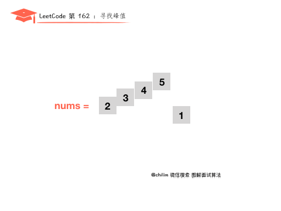

The title comes from question No. 162 on LeetCode: Finding Peaks. The difficulty of the questions is medium, and the current pass rate is 46.3%.
##Title description
A peak element is an element whose value is greater than the adjacent values ​​to the left and right.
Given an input array ``` nums``` where ```nums[i] ≠ nums[i+1]```, find the peak element and return its index.
The array may contain multiple peaks, in which case just return the location of any peak.
You can assume that ```nums[-1] = nums[n] = -∞```.

```
Example 1:

Input: nums = [1,2,3,1]
Output: 2
Explanation: 3 is the peak element and your function should return its index 2.
Example 2:

Input: nums = [1,2,1,3,5,6,4]
Output: 1 or 5
Explanation: Your function can return index 1, whose peak element is 2, or index 5, whose peak element is 6.
illustrate:
Your solution should be O(logN) time complexity.
```
##Question analysis
We can learn the following three key pieces of information from the question:
- ``nums[i] ≠ nums[i+1]```, which means that there are no elements with equal values ​​in the array, either ``nums[i]>nums[i+1]``, or ``nums[i]<nums[i+1]```
- The array may have multiple peaks, we only need to return the index of any peak.
- Assume that ```nums[-1] = nums[n] = -∞```, because both ends of the array are negative infinity, which means that starting from ````nums[0]````, until a value ````nums[i]>nums[i+1]```` is found, then the array must have a peak, and we can just return its index.

In order to better understand the problem-solving ideas, we first start with the linear search method and divide the arrays into three categories, namely ascending arrays, descending arrays, and unordered arrays. Then, since we only need to find any one peak, just return its index. So we can also use the binary search method (**PS: For any search type question, the first thing that comes to mind should be the more efficient binary search method**)
## Solution 1: Linear scan

**1. Assume that the array is an ascending array**

Then it is obvious that our peak is the last element 5, because nums[0]>nums[1], nums[1]>nums[2], ..., nums[3]>nums[4], nums[4] is the last element, so its peak index is 4.
**2. Assume that the array is a descending array**

Because ```nums[-1]=-∞```, and ```nums[0]>mums[1]````, so ```nums[0]``` is a peak value, and the returned peak index is 0.
**3. Assume that the array is an unordered array**

Similarly, we start from ```nums[0]``` and compare the sizes later, because ```nums[0]<nums[1],mums[1]<nums[2],mums[2]<nums[3],mums[3]>mums[4]````, so we can know that ```mums[3]``` is a peak value, and the returned index is 3.

Through the above classification and analysis of arrays, we can find that as long as we start from ```nums[0]```, compare it with the next element until we find ```nums[i]>nums[i+1]```, so far, we have found a peak value, and the index of this peak value is ````i````. If ```nums[i]>nums[i+1]```` has not been found, then the peak value is the last element of the array, and the index is ```nums.length-1````.

##Animation understanding


##Code implementation
```
public class Solution {
    public int findPeakElement(int[] nums) {
        for (int i = 0; i < nums.length - 1; i++) {
            if (nums[i] > nums[i + 1])
                return i;
        }
        return nums.length - 1;
    }
}
```
##Complexity analysis

- Time complexity: O(n), we only traverse the array nums of length n once.
- Space complexity: O(1), only constant space is used

##Solution 2: Binary search

According to the principle of binary search, we assume that the left index ```L=0```, the right index ```R=nums.length - 1``, ​​and the middle index ```M= (L+R)/2```. Now the main thing is to determine whether the peak is on the left or right of ```M```, and then move ```L``` or ``R``` to further narrow the search range.

We find the middle element, and then compare it with the element to the right of the middle element, just like method 1 linear scan.
- If ```nums[M]<nums[M+1]```, then you can know that there will definitely be a peak on the right side of the middle element ```M```, so we move ````L```` to the position of ```M+1``` and search on the right side of ```M```. And recalculate the value of ```M```.
- If ```nums[M]>nums[M+1]```, then we know that there will definitely be a peak on the left side of the middle element ```M```, so we move ```R``` to the position of ```M```, search on the left side of ```M```, and recalculate the value of ```M```.
- Repeat the above steps until ```R=L```, then this is the peak element.

##Animation understanding



##Code implementation

```
public class Solution {
    public int findPeakElement(int[] nums) {
        int l = 0, r = nums.length - 1;
        while (l < r) {
            int mid = (l + r) / 2;
            if (nums[mid] > nums[mid + 1])
                r = mid;
            else
                l = mid + 1;
        }
        return l;
    }
}
```

##Complexity analysis

- Time complexity: O(log2(n)), each step reduces the search space by half, where n is the length of the nums array. .
- Space complexity: O(1), only constant space is used
