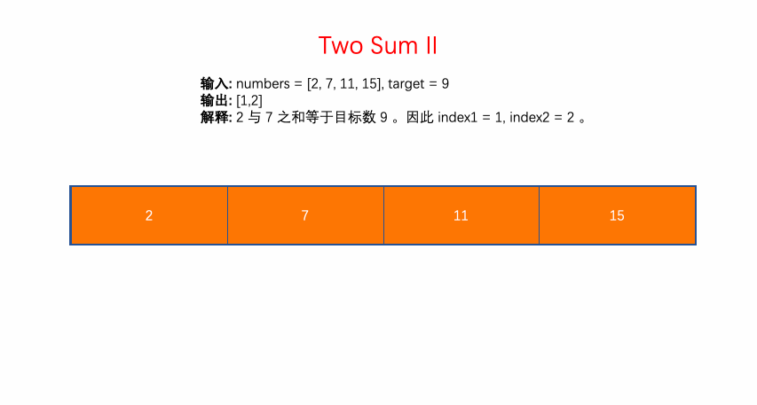

# LeetCode Problem No. 167: Sum of Two Numbers II - Input Sorted Array

> This article was first published on the public account "Illustrated Interview Algorithm" and is one of the series of articles [Illustrated LeetCode](<https://github.com/MisterBooo/LeetCodeAnimation>).
>
> Synchronized blog: https://www.algomooc.com

The question comes from question No. 167 on LeetCode: Sum of Two Numbers II - Input a sorted array. The difficulty of the questions is Easy, and the current passing rate is 48.2%.

### Title description

Given a sorted array sorted in ascending order, find two numbers such that their sum equals the target number.

The function should return the two index values ​​index1 and index2, where index1 must be less than index2*. *

**illustrate:**

- The returned index values ​​(index1 and index2) are not zero-based.
- You can assume that each input corresponds to a unique answer, and you cannot reuse the same elements.

**Example:**

```
Input: numbers = [2, 7, 11, 15], target = 9
Output: [1,2]
Explanation: The sum of 2 and 7 equals the target number 9. Therefore index1 = 1, index2 = 2.
```

### Question analysis

Initialize the left pointer left to point to the beginning of the array, and initialize the right pointer right to point to the end of the array.

According to the **sorted** feature,

- (1) If tmp, the sum of numbers[left] and numbers[right], is less than target, it means that tmp should be increased, so left shifts right to point to a larger value.
- (2) If tmp is greater than target, it means that tmp should be reduced, so right moves left to point to a smaller value.
- (3) If tmp is equal to target, it is found and left + 1 and right + 1 are returned. (Note that the starting index is 1)

### Animation description



### Code implementation
#### C++
```c++
// Collision pointers
// Time complexity: O(n)
// Space complexity: O(1)
class Solution {
public:
    vector<int> twoSum(vector<int>& numbers, int target) {
        int n = numbers.size();
        int left = 0;
        int right = n-1;
        while(left <= right)
        {
            if(numbers[left] + numbers[right] == target)
            {
                return {left + 1, right + 1};
            }
            else if (numbers[left] + numbers[right] > target)
            {
                right--;
            }
            else
            {
                left++;
            }
        }
        return {-1, -1};
    }
};
```
#### Java
```java
class Solution {
    public int[] twoSum(int[] numbers, int target) {
        int n = numbers.length;
        int left = 0;
        int right = n-1;
        while(left <= right)
        {
            if(numbers[left] + numbers[right] == target)
            {
                return new int[]{left + 1, right + 1};
            }
            else if (numbers[left] + numbers[right] > target)
            {
                right--;
            }
            else
            {
                left++;
            }
        }
        
        return new int[]{-1, -1};
    }
}
```
#### Python
```python
class Solution(object):
    def twoSum(self, numbers, target):
        n = len(numbers)
        left,right = 0, n-1
        while left <= right:
            if numbers[left]+numbers[right] == target:
                return [left+1, right+1]
            elif numbers[left]+numbers[right] > target:
                right -=1
            else:
                left +=1

        return [-1, -1]
```


