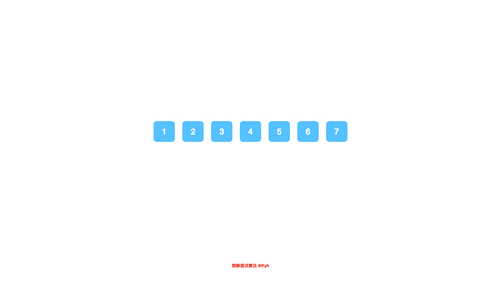

# LeetCode Issue No. 189: Rotating Arrays

> This article was first published on the public account "Illustrated Interview Algorithm" and is one of the series of articles [Illustrated LeetCode](<https://github.com/MisterBooo/LeetCodeAnimation>).
>
> Synchronized blog: https://www.algomooc.com

The question comes from question No. 189 on LeetCode: Rotating Arrays. The difficulty of the questions is Easy, and the current passing rate is 41.7%.

### Title description

Given an array, move the elements in the array k positions to the right, where k is a non-negative number.

**Example 1:**

```
Input: [1,2,3,4,5,6,7] and k = 3
Output: [5,6,7,1,2,3,4]
explain:
Rotate right 1 step: [7,1,2,3,4,5,6]
Rotate right 2 steps: [6,7,1,2,3,4,5]
Rotate right 3 steps: [5,6,7,1,2,3,4]
```

**Example 2:**

```
Input: [-1,-100,3,99] and k = 2
Output: [3,99,-1,-100]
explain:
Rotate right 1 step: [99,-1,-100,3]
Rotate right 2 steps: [3,99,-1,-100]
```

**illustrate:**

* Come up with as many solutions as possible, at least three different ways to solve the problem.
* Requires an in-place algorithm with O(1) space complexity.

<br>

### Question analysis

If there is no space complexity limit of `O(1)`, this question will be relatively simple. All you need to do is to copy an array, then overwrite the elements in the `[n - k, n]` interval at the beginning of the array, and then traverse and overwrite the remaining elements.

Not being able to use extra space means you have to start with the array itself. Here we can solve this problem by using the reverse array. This is a little trick of rotating the array. If you observe carefully, you will find that the array will become two consecutive intervals after rotate. The order of the elements in these two intervals is the same as the order before rotate. First, we reverse all the elements in the array, and then reverse the two intervals respectively, so that the order within the intervals is the same as before. You can look at the animation or try it yourself. There are no complicated knowledge points here, just tips on array operations. After understanding it, you can apply it to other rotate array scenarios.

<br>

### Code implementation

```java
class Solution {
    public void rotate(int[] nums, int k) {
        if (nums.length < k) {
            k %= nums.length;
        }

        reverse(nums, 0, nums.length - 1);
        reverse(nums, 0, k - 1);
        reverse(nums, k, nums.length - 1);
    }

    public void reverse(int[] nums, int start, int end) {
        while (start < end) {
            int tmp = nums[start];
            nums[start] = nums[end];
            nums[end] = tmp;
        }
    }
}
```

<br>

### Animation description



<br>

### Complexity analysis

Space: O(1)

Time: O(n)


