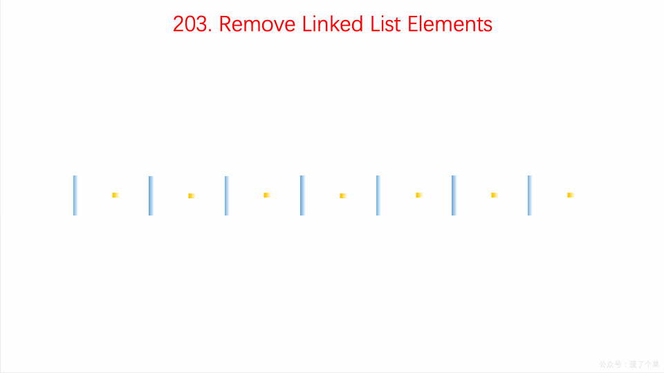

# LeetCode Issue No. 203: Remove linked list elements

> This article was first published on the public account "Illustrated Interview Algorithm" and is one of the series of articles [Illustrated LeetCode](<https://github.com/MisterBooo/LeetCodeAnimation>).
>
> Synchronized blog: https://www.algomooc.com

The question comes from question No. 203 on LeetCode: Remove linked list elements. The difficulty of the questions is Easy, and the current passing rate is 55.8%.

### Title description

Delete all nodes in the linked list that are equal to the given value **val**.

**Example:**

```
Input: 1->2->6->3->4->5->6, val = 6
Output: 1->2->3->4->5
```

### Question analysis

It mainly examines the basic knowledge points of linked list traversal and pointer setting.

Define a virtual head node `dummyHead`, traverse the original linked list, and when encountering an element with the same value as the given value, connect the two nodes before and after the element, and then delete the element.

### Animation description



### Code implementation

#### Code 1

```
// 203. Remove Linked List Elements
// https://leetcode.com/problems/remove-linked-list-elements/description/
//Use virtual header node
// Time complexity: O(n)
// Space complexity: O(1)
class Solution {
public:
    ListNode* removeElements(ListNode* head, int val) {

        //Create virtual header node
        ListNode* dummyHead = new ListNode(0);
        dummyHead->next = head;

        ListNode* cur = dummyHead;
        while(cur->next != NULL){
            if(cur->next->val == val){
                ListNode* delNode = cur->next;
                cur->next = delNode->next;
                delete delNode;
            }
            else
                cur = cur->next;
        }

        ListNode* retNode = dummyHead->next;
        delete dummyHead;

        return retNode;
    }
};

```

#### Code 2

Use recursion to solve.

By recursively calling to the end of the linked list, and then coming back, if you want to delete the element, just point the next pointer of the linked list to the next element.

```
class Solution {
public:
    ListNode* removeElements(ListNode* head, int val) {
        if (!head) return NULL;
        head->next = removeElements(head->next, val);
        return head->val == val ? head->next : head;
    }
};
```

