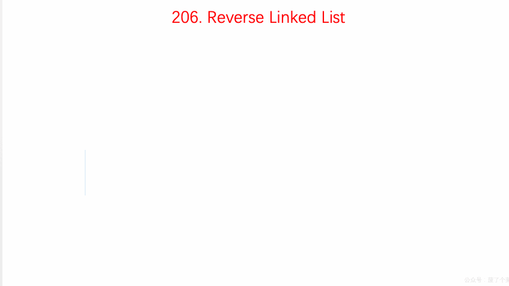

# LeetCode Issue No. 206: Reverse linked list

> This article was first published on the public account "Illustrated Interview Algorithm" and is one of the series of articles [Illustrated LeetCode](<https://github.com/MisterBooo/LeetCodeAnimation>).
>
> Synchronized blog: https://www.algomooc.com

The question comes from question No. 206 on LeetCode: Reverse linked list. The difficulty of the questions is Easy, and the current passing rate is 45.8%.

### Title description

Reverse a singly linked list.

**Example:**

```
Input: 1->2->3->4->5->NULL
Output: 5->4->3->2->1->NULL
```

**Advanced:**
You can reverse a linked list iteratively or recursively. Can you solve this problem in two ways?

### Question analysis

Set three nodes `pre`, `cur`, `next`

- (1) Check whether the `cur` node is `NULL` each time. If so, end the loop and obtain the result.
- (2) If the `cur` node is not `NULL`, first set the temporary variable `next` to the next node of `cur`
- (3) Let the next node of `cur` point to `pre`, then `pre` moves `cur`, and `cur` moves to `next`
- (4) Repeat (1) (2) (3)

### Animation description



### Code implementation

```
class Solution {
public:
    ListNode* reverseList(ListNode* head) {
        ListNode* pre = NULL;
        ListNode* cur = head;
        while(cur != NULL){
            ListNode* next = cur->next;
            cur->next = pre;
            pre = cur;
            cur = next;
        }

        return pre;
    }
};
```


