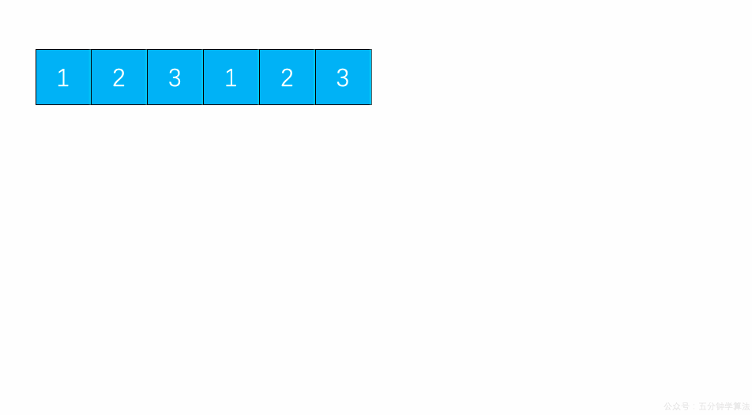

# LeetCode Issue No. 219: Duplicate elements exist II

> This article was first published on the public account "Illustrated Interview Algorithm" and is one of the series of articles [Illustrated LeetCode](<https://github.com/MisterBooo/LeetCodeAnimation>).
>
> Synchronized blog: https://www.algomooc.com

The question comes from question No. 219 on LeetCode: There are duplicate elements II. The difficulty of the questions is Easy, and the current passing rate is 34.8%.

### Title description

Given an integer array and an integer *k*, determine whether there are two different indices *i* and *j* in the array such that **nums[i] = nums[j]**, and the absolute value of the difference between *i* and *j* is at most *k*.

**Example 1:**

```
Input: nums = [1,2,3,1], k = 3
Output: true
```

**Example 2:**

```
Input: nums = [1,0,1,1], k = 1
Output: true
```

**Example 3:**

```
Input: nums = [1,2,3,1,2,3], k = 2
Output: false
```

### Question analysis

Consider using sliding windows and lookup tables to solve this problem.

* Set the lookup table `record` to save the elements inserted during each traversal. The maximum length of `record` is `k`
* Traverse the array `nums`, and each time it traverses, check whether the same element exists in `record`. If it exists, return `true`, and the traversal ends
* If this traversal is not found in `record`, insert the element into `record`, and then check whether the length of `record` is `k + 1`
* If the length of `record` is `k + 1` at this time, delete the element of `record`, and the value of this element is `nums[i - k]`
* If the entire array `nums` is not found, return `false`

### Animation description



### Code implementation

```
// 219. Contains Duplicate II
// https://leetcode.com/problems/contains-duplicate-ii/description/
// Time complexity: O(n)
// Space complexity: O(k)
class Solution {
public:
    bool containsNearbyDuplicate(vector<int>& nums, int k) {

        if(nums.size() <= 1)  return false;

        if(k <= 0)  return false;
        

        unordered_set<int> record;
        for(int i = 0 ; i < nums.size() ; i ++){

            if(record.find(nums[i]) != record.end()){
                return true;
            }

            record.insert(nums[i]);

            // Keep at most k elements in the record
            // Because a new element will be added in the next loop, a total of k+1 elements will be considered
            if(record.size() == k + 1){
                record.erase(nums[i - k]);
            }
        }

        return false;
    }
};
```

