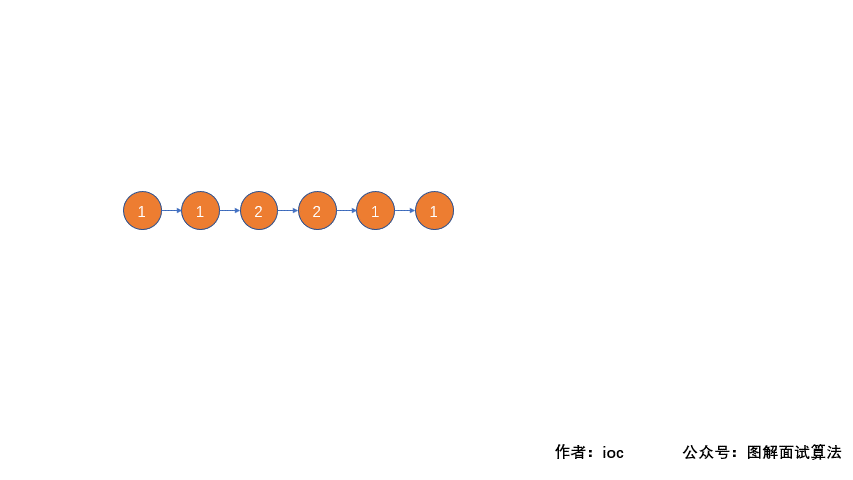

## LeetCode Question No. 234: Palindrome Linked List

> This article was first published on the public account "Illustrated Interview Algorithm" and is one of the series of articles [Illustrated LeetCode](<https://github.com/MisterBooo/LeetCodeAnimation>).
>
> Personal blog: www.zhangxiaoshuai.fun

**This question chooses Leetcode question 234, easy difficulty, the current pass rate is 41.5%**

```txt
Topic description:
Please determine whether a linked list is a palindrome linked list.
Example 1:
    Input: 1->2
    Output: false

Example 2:
    Input: 1->2->2->1
    Output: true
```

***This question also has an advanced version. Let’s implement this ordinary version first and then look at it. ***

### Question analysis:

```
First, we traverse the linked list and store each value in the linked list into an array. Then we determine whether the elements in the array meet the palindrome number condition.
Here, because we don't know the length of the linked list, we first use a dynamic array to store the value, and then store it in a fixed-size array.
```

### Solution: GIF animation demonstration:


### Code:

```java
public boolean isPalindrome(ListNode head) {
    List<Integer> list = new ArrayList<>();
    while (head != null) {
        list.add(head.val);
        head = head.next;
    }
    int[] arr = new int[list.toArray().length];
    int temp = 0;
    for (int a : list) {
        arr[temp++] = a;
    }
    temp = 0;
    for (int i = 0;i < arr.length/2;i++) {
        if (arr[i] == arr[arr.length-i-1]) {
            temp++;
        }
    }
    if(temp == arr.length/2) return true;
    return false;
}
```

**Time complexity: O(n) Space complexity: O(n)**

### Advanced:

**Can you solve this problem in O(n) time complexity and O(1) space complexity? **

**Idea analysis:** We first find the middle node of the linked list, and then invert the linked list behind the middle node. After the inversion, compare it with the first half of the linked list. If they are the same, it means that the linked list is a palindromic linked list, and returns true; otherwise, it returns false.

### Solution 2 gif animation demonstration:



### Code:

```java
public boolean isPalindrome(ListNode head) {
   if(head == null  || head.next == null)   return true;
   ListNode p = new ListNode(-1);
   ListNode low = p;
   ListNode fast = p;
   p.next = head;
   //Use fast and slow pointers to determine intermediate nodes
   while(fast != null && fast.next != null){
       low = low.next;
       fast = fast.next.next;
   }
   ListNode cur = low.next;
   ListNode pre = null;
   low.next = null;
   low = p.next;

   //Reverse the second half of the linked list
   while(cur != null){
       ListNode tmp = cur.next;
       cur.next = pre;
       pre = cur;
       cur = tmp;
   }
   //Compare the first half of the linked list with the second half
   while(pre != null){
       if(low.val != pre.val){
           return false;
       }
       low = low.next;
       pre = pre.next;
   }
   return true;
}
```

**Time complexity: O(n) Space complexity: O(1)**

**Yes, you can see that the above code is completely passable. Although we have completed the question, we have changed the structure of the linked list, which means that it is not it now; the person who asked the question probably does not want us to destroy the linked list, so after we complete the judgment, we need to restore the linked list to its original state, that is, reverse the second half of the linked list and connect it to the end of the first half of the linked list. **