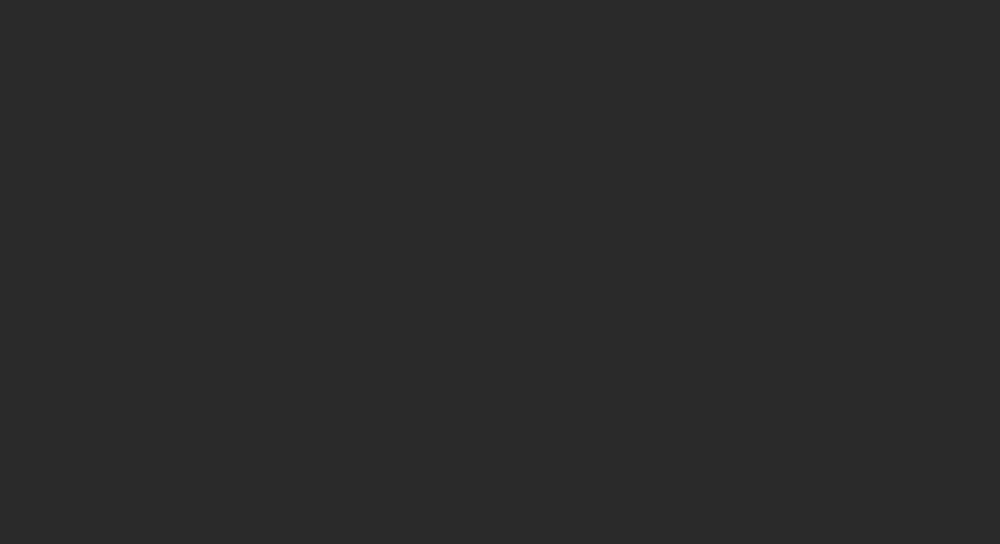

# LeetCode Issue No. 239: Maximum sliding window

> This article was first published on the public account "Illustrated Interview Algorithm" and is one of the series of articles [Illustrated LeetCode](<https://github.com/MisterBooo/LeetCodeAnimation>).
>
> Synchronized blog: https://www.algomooc.com

The question comes from question No. 239 on LeetCode: Maximum value of sliding window. The difficulty of the questions is Hard, and the current passing rate is 40.5%.

### Title description

Given an array *nums*, there is a sliding window of size *k* moving from the leftmost side of the array to the rightmost side of the array. You can only see numbers within the sliding window *k*. The sliding window only moves one position to the right at a time.

Returns the sliding window maximum value.

**Example:**

```
Input: nums = [1,3,-1,-3,5,3,6,7], and k = 3
Output: [3,3,5,5,6,7]
explain:

  Sliding window position maximum
---------------               -----
[1  3  -1] -3  5  3  6  7       3
 1 [3  -1  -3] 5  3  6  7       3
 1  3 [-1  -3  5] 3  6  7       5
 1  3  -1 [-3  5  3] 6  7       5
 1  3  -1  -3 [5  3  6] 7       6
 1  3  -1  -3  5 [3  6  7]      7
```

**Notice:**

You can assume that *k* is always valid, 1 ≤ k ≤ the size of the input array, and that the input array is not empty.

**Advanced:**

Can you solve this problem in linear time complexity?

### Question analysis

Use a **double-ended queue** to store the position of the element in the array in the queue, and maintain strict decrement of the queue, that is to say, the head element of the queue is maintained to be the **largest**. When a new element is traversed, if there is an element in the queue that is smaller than the current element, it will be removed from the queue to ensure the decrement of the queue. When the difference in queue element positions is greater than k, the head element of the queue is removed.

### Supplement: What is a double-ended queue (Dqueue)

Deque means "double ended queue", which is a data structure with the properties of queue and stack. As the name suggests, it is a queue that supports insertion and deletion operations on both the front end and the back end.

Deque inherits from Queue (queue), and its direct implementations include ArrayDeque, LinkedList, etc.

### Animation description



### Code implementation

```
class Solution {
   public int[] maxSlidingWindow(int[] nums, int k) {
        //It's a bit tricky. The question says that the array is not empty and k > 0. But after taking a look, the test case still contains nums = [], k = 0, so I had to add this judgment.
        if (nums == null || nums.length < k || k == 0) return new int[0];
        int[] res = new int[nums.length - k + 1];
        //double ended queue
        Deque<Integer> deque = new LinkedList<>();
        for (int i = 0; i < nums.length; i++) {
            //Add elements to the tail and ensure that the elements on the left are larger than the tail
            while (!deque.isEmpty() && nums[deque.getLast()] < nums[i]) {
                deque.removeLast();
            }
            deque.addLast(i);
            //Remove elements from the head
            if (deque.getFirst() == i - k) {
                deque.removeFirst();
            }
            //Output results
            if (i >= k - 1) {
                res[i - k + 1] = nums[deque.getFirst()];
            }
        }
        return res;
     }
}
```


