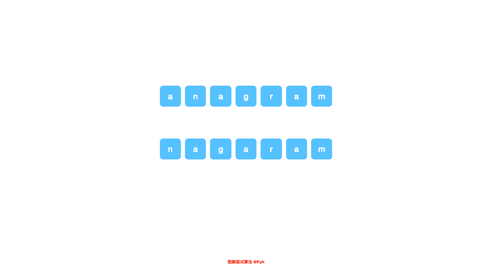

# LeetCode Issue No. 242: Valid Anagrams

> This article was first published on the public account "Illustrated Interview Algorithm" and is one of the series of articles [Illustrated LeetCode](<https://github.com/MisterBooo/LeetCodeAnimation>).
>
> Synchronized blog: https://www.algomooc.com

The question comes from question 242 on LeetCode: Valid allophones. The difficulty of the questions is Easy, and the current passing rate is 60.5%.

### Title description

Given two strings s and t , write a function to determine whether t is an anagram of s .

**Example 1:**

```
Input: s = "anagram", t = "nagaram"
Output: true
```

**Example 2:**

```
Input: s = "rat", t = "car"
Output: false
```

**illustrate:**

You can assume that the string contains only lowercase letters.

**Advanced:**

What if the input string contains unicode characters? Can you adapt your solution to handle this situation?

### Question analysis

The meaning of anagrams is that if two strings are anagrams of each other, then the number and types of characters in the two strings are the same, but the difference is the position and order in which each character appears. The simplest method is to directly sort the strings according to certain rules, and then traverse and compare them. This method saves space, but because it involves sorting, the time complexity is `O(nlgn)`.

There is another method similar to counting sorting, which is to count the number of all characters in a string, and then compare it with another string. This can reduce the time complexity to `O(n)`. If the string in this question only contains lowercase letters, we can open an array with a length of 26, so that no additional space is needed. But if the input string contains unicode characters, due to unicode The character set is too large, and constant-level arrays become less desirable. We can consider using a structure such as a hash table for storage. The logic is the same as before, but the space complexity here is no longer `O(1)`, but `O(n)`

<br>

### Code implementation (sorting)

```java
public boolean isAnagram(String s, String t) {
    if ((s == null) || (t == null) || (t.length() != s.length())) {
        return false;
    }
    char[] sArr1 = s.toCharArray();
    char[] sArr2 = t.toCharArray();
    Arrays.sort(sArr1);
    Arrays.sort(sArr2);
    return Arrays.equals(sArr1, sArr2);
}
```

### Code implementation (hash)

```java
public boolean isAnagram(String s, String t) {
    if ((s == null) || (t == null) || (t.length() != s.length())) {
        return false;
    }
    
    int n = s.length();

    Map<Character, Integer> counts = new HashMap<>();

    for (int i = 0; i < n; ++i) {
        counts.put(s.charAt(i), counts.getOrDefault(s.charAt(i), 0) + 1);
    }

    for (int i = 0; i < n; ++i) {
        counts.put(t.charAt(i), counts.getOrDefault(t.charAt(i), 0) - 1);
        if (counts.getOrDefault(t.charAt(i), -1) < 0) {
            return false;
        }
    }

    return true;
}
```

### Animation description




