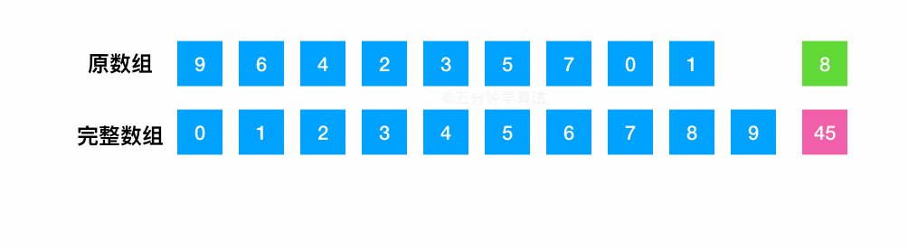

# LeetCode Issue No. 268: Missing Numbers

> This article was first published on the public account "Illustrated Interview Algorithm" and is one of the series of articles [Illustrated LeetCode](<https://github.com/MisterBooo/LeetCodeAnimation>).
>
> Synchronized blog: https://www.algomooc.com

Today I will share a very simple algorithm question.

The question comes from question No. 268 on LeetCode: Missing Numbers. The difficulty of the questions is Easy, and the current passing rate is 50.2%.

## Title description

Given a sequence containing *n* numbers in `0, 1, 2, ..., n`, find the number among 0 .. *n* that does not appear in the sequence.

**illustrate:**

Your algorithm should have linear time complexity. Can you do it without using extra space?


## Question analysis

There are three solutions to this question.

### Solution 1: XOR method

It is very similar to the previous **number that only appears once**:

> Numbers that appear only once: Given a **non-empty** array of integers, each element appears twice except for one element that appears only once. Find the element that appears only once.

If we add a complete array and combine it with the original array, the problem solved becomes **numbers that only appear once**.

XOR the array with one missing number and the complete array between 0 and n, because the same number will become 0 through XOR, then after XORing all the numbers, the remaining number will be the missing number.


#### Code implementation 1

```java
class Solution {
    public int missingNumber(int[] nums) {
        int res = 0;
        int i = 0;
        //Pay attention to array out-of-bounds situations
        for (; i < nums.length;i++){
            // i represents the number in the complete array, XOR it with the number nums[i] in the original array, and then XOR it with the saved result
            res = res^i^nums[i];
        }
        //Finally, it needs to be XORed with the largest number that cannot be used in the loop
        return res^i;
    }
}
```

#### Code implementation 2

```java
class Solution {
   public int missingNumber(int[] nums) {
    int res = nums.length;
    for (int i = 0; i < nums.length; ++i){
        res ^= nums[i];
        res ^= i;
    }
    return res;
  }
}
```


### Solution 2: Summation method

- Find the sum of all numbers between 0 and n
- Iterate through the array and calculate the cumulative sum of the numbers in the original array
- Subtract two sums, and the difference is the missing number.



```java
//Xiao Wu was worried about data overflow before, but I guess this is not what this question is examining, so the test case is not written like this. It can still be AC.
class Solution {
   public int missingNumber(int[] nums) {
        int n = nums.length;
        int sum = (n+0)*(n+1)/2;
        for (int i=0; i<n; i++){
            sum -= nums[i];
        }
        return sum;
 }
}
```


### Solution 3: Dichotomy

After sorting the array, use binary search to find the missing numbers. Note that the search range is 0 to n.

- First sort the array
- Compare the element value and the subscript value. If the element value is greater than the subscript value, it means that the missing number is on the left. In this case, right is assigned to mid, otherwise left is assigned to mid + 1.

> Note: Since the sorting operation is performed at the beginning, the performance of using the binary method is not as good as the above two methods.

```java
public class Solution {
    public int missingNumber(int[] nums) {
        Arrays.sort(nums);
        int left = 0;
        int right = nums.length;
        while (left < right){
            int mid = (left + right) / 2;
            if (nums[mid] > mid){
                right = mid;
            }else{
                left = mid + 1;  
            }
        }
        return left;
    }
}
```


