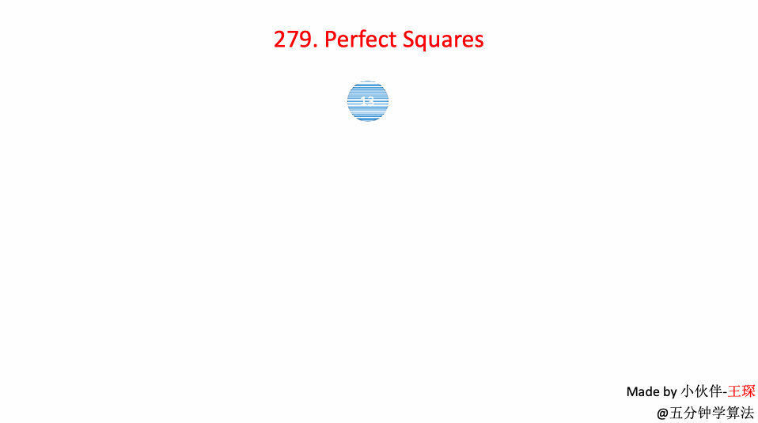

# LeetCode Problem No. 279: Perfect Square Numbers

> This article was first published on the public account "Illustrated Interview Algorithm" and is one of the series of articles [Illustrated LeetCode](<https://github.com/MisterBooo/LeetCodeAnimation>).
>
> Synchronized blog: https://www.algomooc.com

The question comes from question No. 279 on LeetCode: Perfect Square Numbers. The difficulty level of the questions is Medium, and the current pass rate is 49.1%.

### Title description

Given a positive integer *n*, find a number of perfect square numbers (such as `1, 4, 9, 16, ...`) such that their sum equals *n*. You need to minimize the number of perfect squares that make up the sum.

**Example 1:**

```
Input: n = 12
Output: 3
Explanation: 12 = 4 + 4 + 4.
```

**Example 2:**

```
Input: n = 13
Output: 2
Explanation: 13 = 4 + 9.
```

### Question analysis

This question is very interesting.

The answers given in most articles rely on a theorem: **Four Square Theorem**.

The four square theorem states that any positive integer can be expressed as the sum of the squares of no more than four integers. In other words, there are only four possible answers to this question: 1, 2, 3, and 4.

At the same time, there is also a very important corollary that the number n that satisfies the sum of squares theorem of four numbers (here it must be composed of four numbers, not less than four) must satisfy n = 4<sup>a</sup> * (8b + 7).

To solve this problem based on this important inference, first quickly reduce the input `n`. Then we judge whether the reduced number can be composed of the sum of two square numbers or a square number. If not, we return 3. If it can, we return the number of square numbers.

So the code is very concise, as follows:

```java
public int numSquares(int n) {
        while (n % 4 == 0){
            n /= 4;
        }
        if ( n % 8 == 7){
            return 4;
        }
        int a = 0;
        while ( (a * a) <= n){
            int b = (int)Math.pow((n - a * a),0.5);
             if(a * a + b * b == n) {
            //If possible, return here
            if(a != 0 && b != 0) {
                return 2;
            } else{
                return 1;
            }
        }
        a++;
     }
        return 3;
}
```


But because this chapter is a column on "Breadth-First Traversal", I will add another answer to the breadth-first traversal of a graph:

Using the breadth-first search method, n is subtracted from n by all square numbers smaller than n until n = 0. The number of layers at this time is the final result.

### Animation description



### Code implementation

```
import java.util.LinkedList;
import javafx.util.Pair;
class Solution {
    public int numSquares(int n) {
         if(n == 0)
            return 0;
            
        LinkedList<Pair<Integer, Integer>> queue = new LinkedList<Pair<Integer, Integer>>();
        queue.addLast(new Pair<Integer, Integer>(n, 0));

        boolean[] visited = new boolean[n+1];
        visited[n] = true;

        while(!queue.isEmpty()){
            Pair<Integer, Integer> front = queue.removeFirst();
            int num = front.getKey();
            int step = front.getValue();

            if(num == 0)
                return step;

            for(int i = 1 ; num - i*i >= 0 ; i ++){
                int a = num - i*i;
                if(!visited[a]){
                    if(a == 0) return step + 1;
                    queue.addLast(new Pair(num - i * i, step + 1));
                    visited[num - i * i] = true;
                }
            }
        }
        return 0;
    }
}
```


