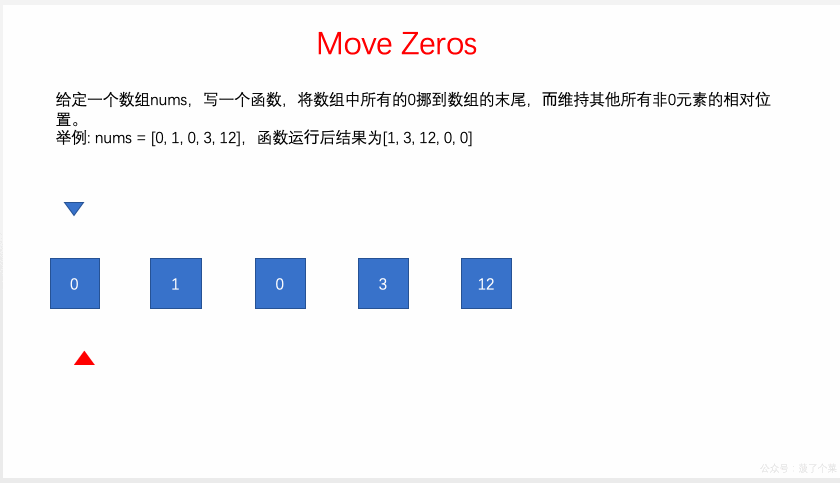

# LeetCode Issue No. 283: Moving Zeros

> This article was first published on the public account "Illustrated Interview Algorithm" and is one of the series of articles [Illustrated LeetCode](<https://github.com/MisterBooo/LeetCodeAnimation>).
>
> Synchronized blog: https://www.algomooc.com

The question comes from question No. 283 on LeetCode: Moving Zeros. The difficulty of the questions is Easy, and the current passing rate is 53.8%.

### Title description

Given an array `nums`, write a function that moves all `0`s to the end of the array while maintaining the relative order of the non-zero elements.

**Example:**

```
Input: [0,1,0,3,12]
Output: [1,3,12,0,0]
```

**illustrate**:

1. The operation must be performed on the original array, and additional arrays cannot be copied.
2. Minimize the number of operations.

### Question analysis

Set a temporary variable k = 0, traverse the array nums, move the non-zero elements to the nums[k] position, use k++ at the same time, and then set the elements in [k,….nums.size()] to zero.

### Solution 1

Create a temporary array nonZeroElements, traverse nums, assign the non-0 elements in nums to nonZeroElements, and then assign nonZeroElements to nums in order, and set the untraversed elements to 0;

The animation is as follows:


The code is as follows:

```
// Time complexity: O(n)
// Space complexity: O(n)
class Solution {
public:
    void moveZeroes(vector<int>& nums) {

        vector<int> nonZeroElements;

        // Put all non-0 elements in vec into nonZeroElements
        for(int i = 0 ; i < nums.size() ; i ++)
            if(nums[i])
                nonZeroElements.push_back(nums[i]);

        //Put all elements in nonZeroElements to the beginning of nums in sequence
        for(int i = 0 ; i < nonZeroElements.size() ; i ++)
            nums[i] = nonZeroElements[i];

        // Place the remaining positions of nums as 0
        for(int i = nonZeroElements.size() ; i < nums.size() ; i ++)
            nums[i] = 0;
    }
};

```

### Solution 2

Set a temporary variable k = 0, traverse the array nums, move the non-zero elements to the nums[k] position, use k++ at the same time, and then set the elements in [k,….nums.size()] to zero.

The animation is as follows:


The code is as follows:

```
// Solve the problem in place
// Time complexity: O(n)
// Space complexity: O(1)
class Solution {
public:
    void moveZeroes(vector<int>& nums) {

        int k = 0; // In nums, the elements of [0...k) are all non-0 elements

        // After traversing to the i-th element, ensure all non-0 elements in [0...i]
        // They are all arranged in [0...k) in order
        for(int i = 0 ; i < nums.size() ; i ++)
            if(nums[i])
                nums[k++] = nums[i];

        // Place the remaining positions of nums as 0
        for(int i = k ; i < nums.size() ; i ++)
            nums[i] = 0;
    }
};
```

### Solution 3

Idea: Set a temporary variable k = 0, traverse the array nums, exchange non-zero elements with previous zero elements, and maintain the value of variable k.

The animation is as follows:


The code is as follows:

```
// Solve the problem in place
// Time complexity: O(n)
// Space complexity: O(1)
class Solution {
public:
    void moveZeroes(vector<int>& nums) {

        int k = 0; // In nums, the elements of [0...k) are all non-0 elements

        // After traversing to the i-th element, ensure all non-0 elements in [0...i]
        // They are all arranged in [0...k) in order
        // At the same time, [k...i] is 0
        for(int i = 0 ; i < nums.size() ; i ++)
            if(nums[i]){
                if(k != i){
                    swap(nums[k++] , nums[i]);
                }else{
                    k ++;
                }
            }
        }
};

```


