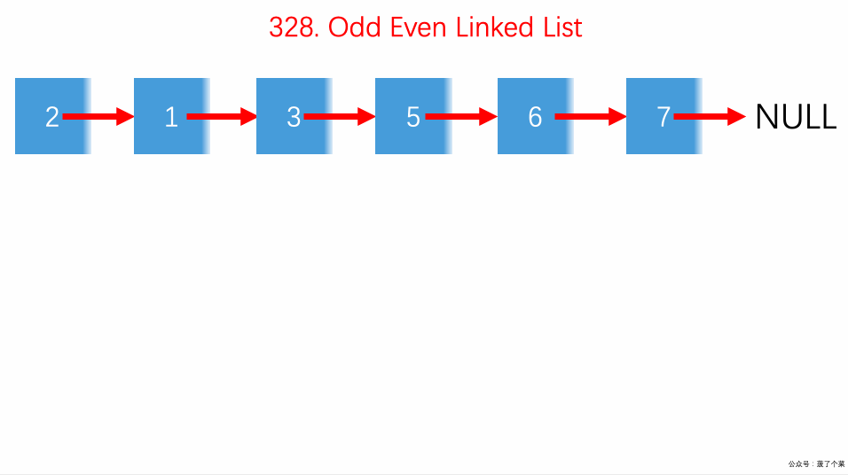

# LeetCode Issue No. 328: Odd-Even Linked List

> This article was first published on the public account "Illustrated Interview Algorithm" and is one of the series of articles [Illustrated LeetCode](<https://github.com/MisterBooo/LeetCodeAnimation>).
>
> Synchronized blog: https://www.algomooc.com

The question comes from question No. 328 on LeetCode: Odd-even linked list. The difficulty level of the questions is Medium, and the current pass rate is 52.0%.

### Title description

Given a singly linked list, arrange all odd nodes and even nodes together. Please note that the odd and even nodes here refer to the parity of the node number, not the parity of the node's value.

Please try to use the in-place algorithm to complete. Your algorithm should have a space complexity of O(1) and a time complexity of O(nodes), where nodes is the total number of nodes.

**Example 1:**

```
Input: 1->2->3->4->5->NULL
Output: 1->3->5->2->4->NULL
```

**Example 2:**

```
Input: 2->1->3->5->6->4->7->NULL
Output: 2->3->6->7->1->5->4->NULL
```

**illustrate:**

- The relative order of odd and even nodes should be maintained.
- The first node of the linked list is considered an odd node, the second node is considered an even node, and so on.

### Question analysis

This question gives us a linked list, allowing us to separate odd and even nodes, with all odd nodes in front and even nodes in the back.

* Set two virtual nodes, `dummyHead1` is used to save odd nodes, `dummyHead2` is used to save even nodes;
* Traverse the entire original linked list, place the odd nodes in `dummyHead1`, and the rest in `dummyHead2`
* After the traversal, insert `dummyHead2` after `dummyHead1`

### Animation description



### Code implementation

```
class Solution {
public:
    ListNode* oddEvenList(ListNode* head) {

        if(head == NULL || head->next == NULL || head->next->next == NULL)
            return head;

        ListNode* dummyHead1 = new ListNode(-1);
        ListNode* dummyHead2 = new ListNode(-1);
        ListNode* p1 = dummyHead1;
        ListNode* p2 = dummyHead2;
        ListNode* p = head;
        for(int i = 0; p; i ++)
            if(i % 2 == 0){
                p1->next = p;
                p = p->next;
                p1 = p1->next;
                p1->next = NULL;
            }
            else{
                p2->next = p;
                p = p->next;
                p2 = p2->next;
                p2->next = NULL;
            }

        p1->next = dummyHead2->next;
        ListNode* ret = dummyHead1->next;

        delete dummyHead1;
        delete dummyHead2;
        return ret;
    }
};
```


