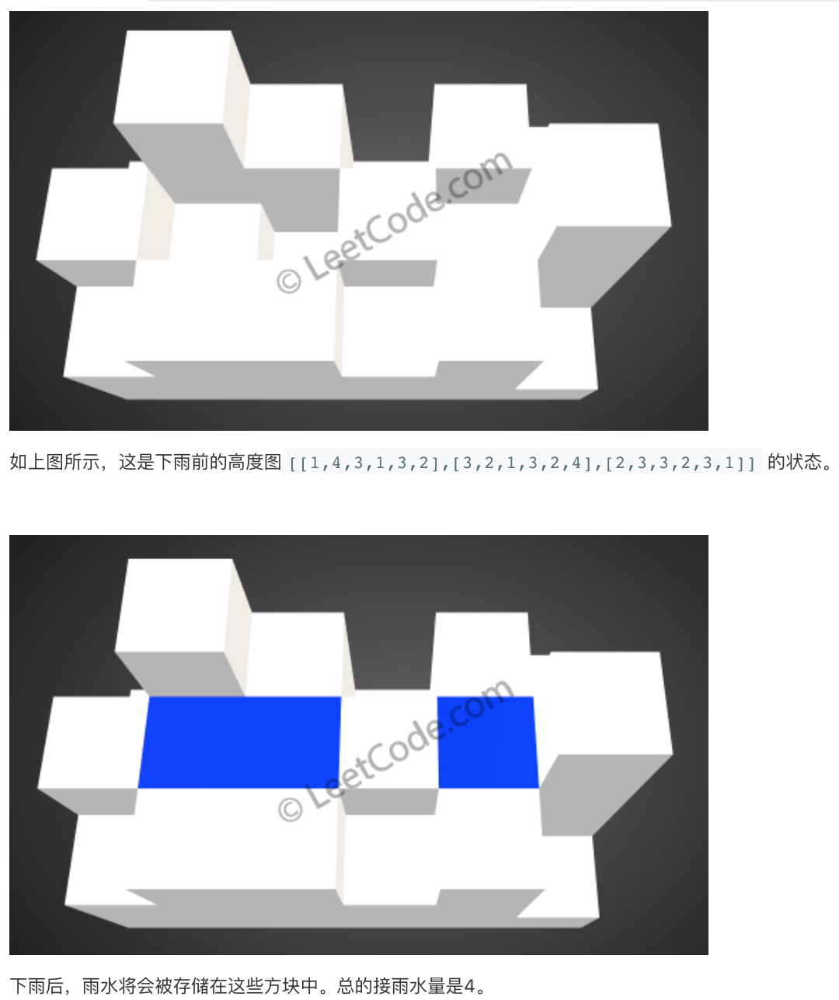

# LeetCode Question No. 407: Catching Rainwater II

> This article was first published on the public account "Illustrated Interview Algorithm" and is one of the series of articles [Illustrated LeetCode](<https://github.com/MisterBooo/LeetCodeAnimation>).
>
> Synchronized blog: https://www.algomooc.com

The question comes from question No. 407 on LeetCode: Catching Rainwater II. The difficulty of the questions is Hard, and the current passing rate is 38%.

### Title description

Given an m x n matrix, the values ​​in it are all positive integers, representing the height of each unit in a two-dimensional height map. Please calculate the maximum volume of rainwater that the shape in the map can receive.

**Example:**

```
This gives the following 3x6 heightmap:
[
  [1,4,3,1,3,2],
  [3,2,1,3,2,4],
  [2,3,3,2,3,1]
]

Return 4 .
```



### Question analysis

In a 2-dimensional matrix, each grid has its height. How much water can this 2-dimensional matrix hold? First of all, we analyze that the necessary condition for a grid to be able to hold water is that there are grids around it that are higher than the current grid, so that the water can be framed. But if we think about it carefully, what about the outermost grid? They cannot store water. You can think of the outermost grids as fences. Their function is to ensure that the water in the inner grids will not flow out, so we have to consider these grids first. Their height directly determines the water storage capacity of the internal grids. However, these grids are also localized. The length of one grid will not affect all grids in the matrix, but it will affect the relationship between Its adjacent grids, then we need to have a consideration order, which is to give priority to the shortest grid in the outermost layer. Since each grid will affect the grids around it, the internal grids also need to be considered. Every time we consider the shortest grid, and then see if there are any grids around it that are shorter than it that have not been considered, so there is a priority of consideration:

1. Consider the outermost grid
2. Select the shortest outermost grid
3. Consider whether the grid and its adjacent internal grid can hold water, and take this internal grid into consideration.
4. Select the shortest grid among all grids under consideration and repeat step 3.

What needs to be noted here is that the grid that is taken into consideration each time is the height after adding water, not the previous height. The reason should not be difficult to understand if you think about it. In addition, the data structure "heap" can be used to help implement the operation step of finding the "shortest grid within the current consideration range".

### Animation description


### Code implementation

```java
private class Pair {
    int x, y, h;
    Pair(int x, int y, int h) {
        this.x = x;
        this.y = y;
        this.h = h;
    }
}

private int[] dirX = {0, 0, -1, 1};
private int[] dirY = {-1, 1, 0, 0};

public int trapRainWater(int[][] heightMap) {
    if (heightMap.length == 0 || heightMap[0].length == 0) {
        return 0;
    }
    
    int m = heightMap.length;
    int n = heightMap[0].length;
    
    PriorityQueue<Pair> pq = new PriorityQueue<>(new Comparator<Pair>() {
        @Override
        public int compare(Pair a, Pair b) {
            return a.h - b.h;
        }
    });
    
    boolean[][] visited = new boolean[m][n];
    
    //Add peripheral elements to the queue first
    for (int i = 0; i < n; ++i) {
        pq.offer(new Pair(0, i, heightMap[0][i]));
        pq.offer(new Pair(m - 1, i, heightMap[m - 1][i]));
        
        visited[0][i] = true;
        visited[m - 1][i] = true;
    }
    
    for (int i = 1; i < m - 1; ++i) {
        pq.offer(new Pair(i, 0, heightMap[i][0]));
        pq.offer(new Pair(i, n - 1, heightMap[i][n - 1]));
        
        visited[i][0] = true;
        visited[i][n - 1] = true;
    }
    
    int result = 0;
    while (!pq.isEmpty()) {
        Pair cur = pq.poll();

        // Traverse the four directions of the current position, up, down, left and right
        for (int k = 0; k < 4; ++k) {
            int curX = cur.x + dirX[k];
            int curY = cur.y + dirY[k];
            
            if (curX < 0 || curY < 0 || curX >= m || curY >= n || visited[curX][curY]) {
                continue;
            }
            
            if (heightMap[curX][curY] < cur.h) {
                result += cur.h - heightMap[curX][curY];
            }
            
            pq.offer(new Pair(curX, curY, 
                              Math.max(heightMap[curX][curY], cur.h)));
            visited[curX][curY] = true;
        }
    }
    
    return result;
}
```

<br>

### Complexity analysis

Because the data structure of the priority queue is used, the time complexity of each element entering and exiting the queue is O(logn), so we can conclude that the overall time complexity is `O(m*n*logm*n)`. Of course, it should be noted that this is the worst time complexity. Since not all elements are added to the queue at one time, the average time complexity is lower than this. What it is depends on the input data. The space complexity is `O(m*n)`, which is not difficult to understand here. Through this question, the usage of heap is well demonstrated.


