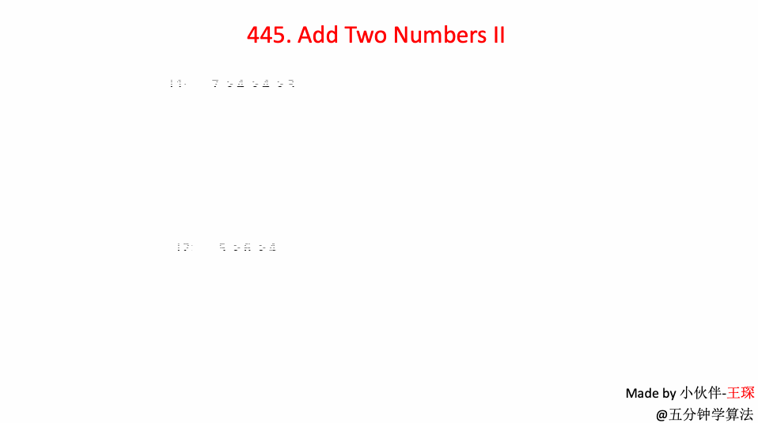

# LeetCode Problem No. 445: Adding Two Numbers II

> This article was first published on the public account "Illustrated Interview Algorithm" and is one of the series of articles [Illustrated LeetCode](<https://github.com/MisterBooo/LeetCodeAnimation>).
>
> Synchronized blog: https://www.algomooc.com

The question comes from question No. 445 on LeetCode: Adding Two Numbers II. The difficulty level of the questions is Medium, and the current passing rate is 48.8%.

### Title description

Given two **non-empty** linked lists representing two non-negative integers. The highest digit of the number is at the beginning of the linked list. Each of their nodes only stores a single number. Adding these two numbers returns a new linked list.

 

You can assume that except for the number 0, neither number will start with a zero.

**Advanced:**

What to do if the input linked list cannot be modified? In other words, you cannot flip nodes in the list.

**Example:**

```
Input: (7 -> 2 -> 4 -> 3) + (5 -> 6 -> 4)
Output: 7 -> 8 -> 0 -> 7
```

### Question analysis

Since the rightmost number must be aligned during calculation, it is natural to think of using a **stack** to store each value in the linked list, and then calculate it in sequence. Since a carry may occur during addition, a flag is used to indicate whether there is a carry.

Tip: If there is still a carry after the addition of elements in the stack, a new head node needs to be added.

### Animation description



### Code implementation

```python
class Solution:
    def addTwoNumbers(self, l1, l2):
        #Push to stack separately
        stack1 = []
        stack2 = []
        while l1:
            stack1.append(l1.val)
            l1 = l1.next
        while l2:
            stack2.append(l2.val)
            l2 = l2.next

        flag = 0
        head = None
        while stack1 or stack2 or flag != 0:
            if stack1:
                flag += stack1.pop()
            if stack2:
                flag += stack2.pop()
            node = ListNode(flag % 10)
            node.next = head
            head = node
            flag = flag // 10
        return head
```


