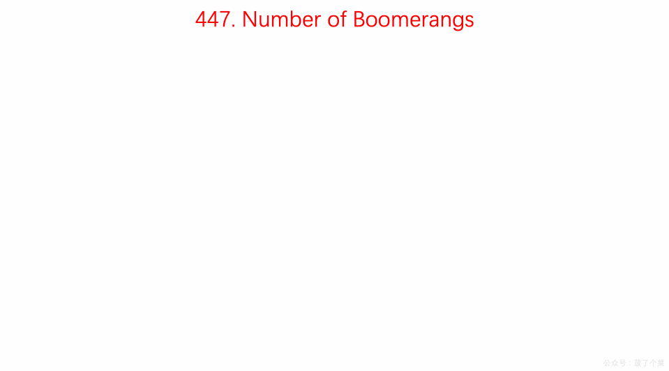

#LeetCode Question No. 447: Number of Boomerangs

> This article was first published on the public account "Illustrated Interview Algorithm" and is one of the series of articles [Illustrated LeetCode](<https://github.com/MisterBooo/LeetCodeAnimation>).
>
> Synchronized blog: https://www.algomooc.com

The question comes from question No. 447 on LeetCode: The number of boomerangs. The difficulty of the questions is Easy, and the current passing rate is 45.8%.

### Title description

Given *n* pairs of distinct points on the plane, a "boomerang" is a tuple `(i, j, k)` represented by the points, where the distance between `i` and `j` is equal to the distance between `i` and `k` (**the order of the tuples needs to be taken into account**).

Find the number of all boomerangs. You can assume that *n* is at most **500** and the coordinates of all points are in the closed interval **[-10000, 10000]**.

**Example:**

```
enter:
[[0,0],[1,0],[2,0]]

Output:
2

explain:
The two boomerangs are [[1,0],[0,0],[2,0]] and [[1,0],[2,0],[0,0]]
```

### Question analysis

The maximum n is 500, and an algorithm with a time complexity of O(n^2) can be used.

- Traverse all points and use each point as an anchor point
- Then traverse other points and count how many points are the same distance from the anchor point.
- Then bring n(n-1) calculation results separately and accumulate them in res

##### Tips：

###### Tip1

- If there is a point a, and two points b and c, if the distance between ab and ac is equal, then there are two ways to arrange abc and acb;
- If there are three points b, c, and d that are all equidistant from a, then there are six arrangement methods, abc, acb, acd, adc, abd, adb;
- If there are n points that are equidistant from point a, then the arrangement is n(n-1).

###### Tip2

- No root operation is performed when calculating distance to ensure accuracy;
- Only when n is greater than or equal to 2, the res value will actually increase, because when n=1, the increase is `1*(1-1)=0`.


### Animation description



### Code implementation

```
// 447. Number of Boomerangs
// https://leetcode.com/problems/number-of-boomerangs/description/
// Time complexity: O(n^2)
// Space complexity: O(n)
class Solution {
public:
    int numberOfBoomerangs(vector<pair<int, int>>& points) {

        int res = 0;
        for( int i = 0 ; i < points.size() ; i ++ ){

            //The record stores the frequency of distances from point i to all other points.
            unordered_map<int, int> record;
            for(int j = 0 ; j < points.size() ; j ++){
                if(j != i){
                    // No root operation is performed when calculating distance to ensure accuracy
                    record[dis(points[i], points[j])] += 1;
                }
            }
            
            for(unordered_map<int, int>::iterator iter = record.begin() ; iter != record.end() ; iter ++){
                res += (iter->second) * (iter->second - 1);
            }
        }
        return res;
    }

private:
    int dis(const pair<int,int> &pa, const pair<int,int> &pb){
        return (pa.first - pb.first) * (pa.first - pb.first) +
               (pa.second - pb.second) * (pa.second - pb.second);
    }
};


```


