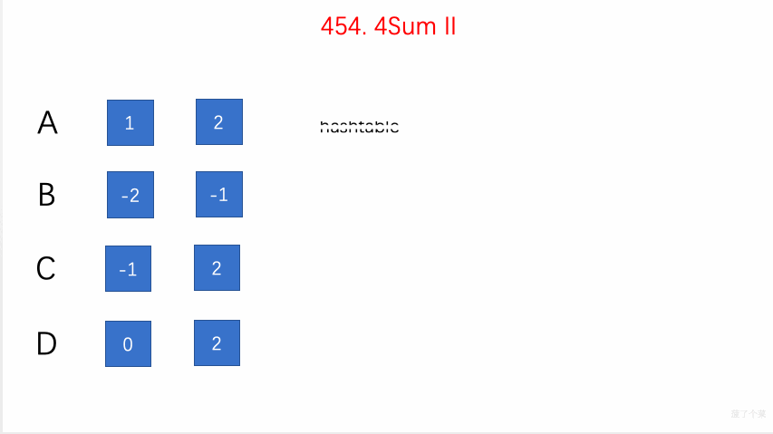

# LeetCode Problem No. 454: Adding Four Numbers II

> This article was first published on the public account "Illustrated Interview Algorithm" and is one of the series of articles [Illustrated LeetCode](<https://github.com/MisterBooo/LeetCodeAnimation>).
>
> Synchronized blog: https://www.algomooc.com

The question comes from question No. 454 on LeetCode: Adding Four Numbers II. The difficulty level of the questions is Medium, and the current pass rate is 50.8%.

### Title description

Given four array lists A , B , C , D containing integers, count how many tuples `(i, j, k, l)` there are such that `A[i] + B[j] + C[k] + D[l] = 0`.

To simplify the problem, all A, B, C, D have the same length N, and 0 ≤ N ≤ 500. All integers range from -228 to 228 - 1, and the final result will not exceed 231 - 1.

**For example:**

```
enter:
A = [ 1, 2]
B = [-2,-1]
C = [-1, 2]
D = [ 0, 2]

Output:
2

explain:
The two tuples are as follows:
1. (0, 0, 0, 1) -> A[0] + B[0] + C[0] + D[1] = 1 + (-2) + (-1) + 2 = 0
2. (1, 1, 0, 0) -> A[1] + B[1] + C[0] + D[0] = 2 + (-1) + (-1) + 0 = 0
```

### Question analysis

Similar to [Two Sum](https://xiaozhuanlan.com/topic/7923618450), a hash table is needed to solve the problem.

- Find the sum of each pair of A and B, and establish a mapping between the sum of the two numbers and their occurrence times in the hash table
- To traverse the sum of any two numbers in C and D, just check whether the opposite number of the sum of these two numbers exists in the hash table.


### Animation description



### Code implementation

```
// 454. 4Sum II
// https://leetcode.com/problems/4sum-ii/description/
// Time complexity: O(n^2)
// Space complexity: O(n^2)
class Solution {
public:
    int fourSumCount(vector<int>& A, vector<int>& B, vector<int>& C, vector<int>& D) {

        unordered_map<int,int> hashtable;
        for(int i = 0 ; i < A.size() ; i ++){
            for(int j = 0 ; j < B.size() ; j ++){
                 hashtable[A[i]+B[j]] += 1;
            }
        }
        
        int res = 0;
        for(int i = 0 ; i < C.size() ; i ++){
            for(int j = 0 ; j < D.size() ; j ++){
                if(hashtable.find(-C[i]-D[j]) != hashtable.end()){
                    res += hashtable[-C[i]-D[j]];
                }
            }
        }
    
        return res;
    }
};

```


