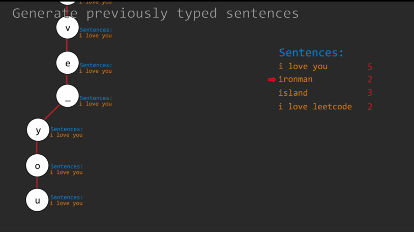

# LeetCode Question No. 642: Design a search autocomplete system

> This article was first published on the public account "Illustrated Interview Algorithm" and is one of the series of articles [Illustrated LeetCode](<https://github.com/MisterBooo/LeetCodeAnimation>).
>
> Synchronized blog: https://www.algomooc.com

The title comes from question No. 642 on LeetCode: Design a search auto-complete system. The difficulty of the questions is Hard, and the current passing rate is 37.8%.

### Title description

Design a search autocomplete system for search engines. The user can enter a sentence (at least one word, ending with a special character '#'). For each character except '#', you need to return the top 3 historical popular sentences with the same prefix as the entered sentence part. The specific rules are as follows:

The popularity of a sentence is defined as the number of times users enter the exact same sentence.
The top 3 popular sentences returned should be sorted by popularity (the first one is the hottest). If several sentences have the same popularity, you need to use ascii code order (showing the smaller one first).
If there are less than 3 popular sentences, return as many as possible.
When the input is a special character it means the end of the sentence, in which case you need to return an empty list.
Your job is to implement the following functionality:

Constructor:

AutocompleteSystem(String[] sentence, int[] times): This is the constructor. The input is historical data. Sentences is a string array consisting of previously entered sentences. Times is the corresponding number of times a sentence is entered. Your system should log this historical data.

Now, the user wants to enter a new sentence. The following function will provide the next character of the user type:

List<String> input(char c): Input c is the next character entered by the user. Characters can only be lowercase letters ("a" to "z"), spaces (""), or special characters ("#"). In addition, the previously entered sentences should be recorded in the system. The output will be the top 3 historical popular sentences with the same prefix as the sentence parts that have been input.

example:
Operation: AutocompleteSystem(["i love you", "island", "ironman", "i love leetcode"], [5,3,2,2])
The system has tracked the following sentences and their corresponding times:

"i love you" : 5 times 
"island" : 3 times 
"ironman" : 2 times 
"i love leetcode" : 2 times 

Now, the user starts another search:

Operation: input("i")
Output: ["i love you", "island", "i love leetcode"]
explain:
There are four sentences with the prefix "i". Among them, "ironman" and "i love leetcode" have the same popularity. Since the " " ASCII code is 32 and the "r" ASCII code is 114, then "i love leetcode" should be in front of "ironman". Furthermore, we only need to output the top 3 popular sentences, so "ironman" will be ignored.

Operation: input(' ')
Output: ["i love you", "i love leetcode"]
explain:
Only two sentences have the prefix "i".

Operation: input(' a ')
Output:[]
explain:
There are no sentences prefixed with "i a".

Operation: Enter ("#")
Output:[]
explain:
After the user completes the input, the sentence "i a" is saved as a historical sentence in the system. The following input will be evaluated as a new search.

Notice:

The entered sentences always start with a letter and end with "#", with only a space between the two words.
There will be no more than 100 complete sentences to search for. The length of each sentence, including historical data, will not exceed 100 sentences.
When writing test cases, use double quotes instead of single quotes even for character input.
Remember to reset the class variables declared in the AutocompleteSystem class as static/class variables are persisted across multiple test cases. Click here for details.

### Question analysis

Design a search auto-completion system, which needs to include the following two methods:

#### Construction method:

AutocompleteSystem(String[] sentences, int[] times): Enter sentence sentences and their occurrence times times

#### Input method:

List<String> input(char c): The input character c can be 26 lowercase English letters or a space, ending with '#'. Returns at most 3 sentences with the highest frequency corresponding to the input character prefix. If the frequencies are equal, they are sorted in dictionary order.

### Idea analysis:

Core point: Trie (dictionary tree)

Use a dictionary tree to record the set of all sentences that have appeared, and use a dictionary to save the number of times each sentence appears.

#### Problem-solving ideas

The requirement of the question is that the completed sentences are arranged according to the frequency of previous occurrences, with the most frequent occurrences at the top. If the frequencies are the same, they are displayed in alphabetical order.

Frequency It is easy to think of knowledge points such as heaps, priority queues, trees, maps, etc. This involves dictionary and tree, so it can definitely be solved by using dictionary tree.

So first construct the trieNode structure and insert method of Trie. After constructing the trieNode class, construct the root node of a tree.

Since we have to enter one character each time, we can use a private Node: curNode to track the current node.

curNode is initialized to root. Every time a sentence is entered, that is, when the entered character is '#', we need to set it to root.

At the same time, a string type stn is also needed to represent the current search sentence.

Each time a character is entered, first check whether it is the ending symbol "#". If so, add the current sentence to the trie tree, reset the relevant variables, and return an empty array.

* If not, check whether the child corresponding to the current TrieNode contains the corresponding node of c. If not, set curNode to NULL and return an empty array.

* If it exists, update curNode to the node corresponding to c, and perform dfs on curNode.

When dfs, we first check whether the current sentence is a complete sentence. If so, add the sentence and its number to the priority_queue at the same time, and then perform dfs on the possible child nodes in its child.

After performing dfs, you only need to take out the first three. It should be noted that there may be less than 3 selectable results, so you need to add more conditional statements to detect that q is empty in the while.

Finally, all elements in q are popped.

### Animation description



### Code implementation

#### C++
```
class TrieNode{
  public:
    string str;
    int cnt;
    unordered_map<char, TrieNode*> child;
    TrieNode(): str(""), cnt(0){};
};

struct cmp{
    bool operator() (const pair<string, int> &p1, const pair<string, int> &p2){
        return p1.second < p2.second || (p1.second == p2.second && p1.first > p2.first);
    }
};

class AutocompleteSystem {
public:
    AutocompleteSystem(vector<string> sentences, vector<int> times) {
        root = new TrieNode();
        for(int i = 0; i < sentences.size(); i++){
            insert(sentences[i], times[i]);
        }
        curNode = root;
        stn = "";
    }
    
    vector<string> input(char c) {
        if(c == '#'){
            insert(stn, 1);
            stn.clear();
            curNode = root;
            return {};
        }
        stn.push_back(c);
        if(curNode && curNode->child.count(c)){
            curNode = curNode->child[c];
        }else{
            curNode = NULL;
            return {};
        }
        
        dfs(curNode);
        
        vector<string> ret;
        int n = 3;
        while(n > 0 && !q.empty()){
            ret.push_back(q.top().first);
            q.pop();
            n--;
        }
        while(!q.empty()) q.pop();
        
        return ret;
    }
    
    void dfs(TrieNode* n){
        if(n->str != ""){
            q.push({n->str, n->cnt});
        }
        for(auto p : n->child){
            dfs(p.second);
        }
    }
    
    void insert(string s, int cnt){
        TrieNode* cur = root;
        for(auto c : s){
            if(cur->child.count(c) == 0){
                cur->child[c] = new TrieNode();
            }
            cur = cur->child[c];
        }
        cur->str = s;
        cur->cnt += cnt;
    }
    
private:
    TrieNode *root, *curNode;
    string stn;
    priority_queue<pair<string,int>, vector<pair<string, int>>, cmp > q;
    
};

```


