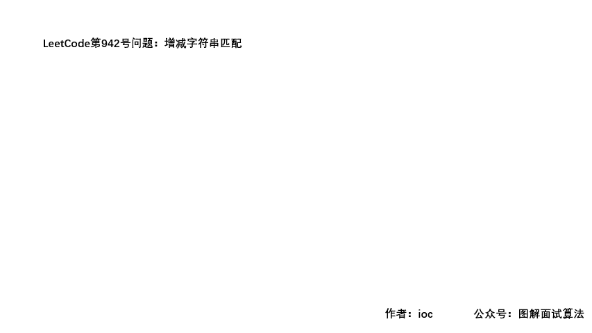

## LeetCode Issue No. 942: Increasing and Decreasing String Matching

> This article was first published on the public account "Illustrated Interview Algorithm" and is one of the series of articles [Illustrated LeetCode](<https://github.com/MisterBooo/LeetCodeAnimation>).
>
> Synchronize personal blog: www.zhangxiaoshuai.fun

This question has question number 942 in leetcode, which belongs to the easy level. The current pass rate is 71.4%.

### Title description:

```
Given a string S containing only "I" (increasing) or "D" (decreasing), let N = S.length.
Returns any permutation A of [0, 1, ..., N] such that for all i = 0, ..., N-1, there is:
    If S[i] == "I", then A[i] < A[i+1]
    If S[i] == "D", then A[i] > A[i+1]

Example 1:
Output: "IDID"
Output: [0,4,1,3,2]

Example 2:
Output: "III"
Output: [0,1,2,3]

Example 3:
Output: "DDI"
Output: [3,2,0,1]

hint:
    1 <= S.length <= 10000
    S contains only the characters "I" or "D"
```

**Question Analysis:**

```
The meaning of the question is very clear, we only need to meet the two conditions given.

1. If the length of the string is N, then the length of the target array is N+1;

2. The numbers in the array are from 0 to N, and there are no repetitions;

3. When encountering ‘I’, increase; when encountering ‘D’, decrease;
```

### GIF animation demonstration:



### Code:

```java
//The official solution is transferred here
public int[] diStringMatch(String S) {
    int N = S.length();
    int lo = 0, hi = N;
    int[] ans = new int[N + 1];
    for (int i = 0; i < N; ++i) {
        if (S.charAt(i) == 'I')
            ans[i] = lo++;
        else
            ans[i] = hi--;
    }
    ans[N] = lo;
    return ans;
}
```

**Although the above code is very concise, it seems that we no longer need to implement anything; but there is more than one sequence that meets the conditions, and the official one seems to only be able to pass one. Although the following code is somewhat redundant, the sequence obtained meets the requirements of the question, but it cannot be AC; **

### Ideas:

```
(1) If ‘I’ is encountered, then the number corresponding to the current position of the array is smaller than the first number to the right of it
(2) If ‘D’ is encountered, then the number corresponding to the current position of the array is greater than the first number to the right of it

First initialize the target array and assign values ​​0~N
We start traversing the string, and if we encounter ‘I’, we determine whether the number at that position in the corresponding array satisfies condition (1).
If satisfied, skip this loop; if not satisfied, swap the positions of the two numbers;
The same idea applies to ‘D’;
```

### GIF animation demonstration:


### Code:

```java
public int[] diStringMatch(String S) {
    int[] res = new int[S.length()+1];
    String[] s = S.split("");
    for (int i = 0; i < res.length; i++) {
        res[i] = i;
    }
    for (int i = 0; i < s.length; i++) {
        if (s[i].equals("I")) {
            //Determine whether the number at the specified position meets the conditions
            if (res[i] < res[i + 1]) {
                continue;
            } else {
                //Swap the positions of the two numbers
                res[i]   = res[i] ^ res[i+1];
                res[i+1] = res[i] ^ res[i+1];
                res[i]   = res[i] ^ res[i+1];
            }
        } else {
            if (res[i] > res[i + 1]) {
                continue;
            } else {
                res[i]   = res[i] ^ res[i+1];
                res[i+1] = res[i] ^ res[i+1];
                res[i]   = res[i] ^ res[i+1];
            }
        }
    }
    return res;
}
```

**If there are any errors or inappropriateness in the above content, please feel free to criticize and correct me. **