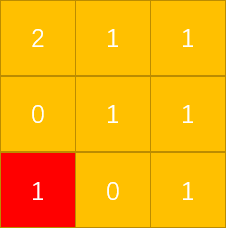

## LeetCode Issue No. 994: Rotten Oranges

> This article was first published on the public account "Illustrated Interview Algorithm" and is one of the series of articles [Illustrated LeetCode](<https://github.com/MisterBooo/LeetCodeAnimation>).
>
> Synchronize personal blog: www.zhangxiaoshuai.fun

This question has the question number 994 in leetcode, which belongs to the medium level. The current pass rate is 50.7%.

**Title description:**

```
In a given grid, each cell can have one of three values:
	A value of 0 represents an empty cell;
	A value of 1 represents fresh oranges;
	A value of 2 represents a rotten orange.
Every minute, any fresh orange adjacent to a rotten orange (in the 4 positive directions) will rot. Returns the minimum number of minutes that must elapse until there are no more fresh oranges in the cell. If not possible, return -1.

Example 1:
	Input: [[2,1,1],[1,1,0],[0,1,1]]
	Output: 4

Example 2:
	Input: [[2,1,1],[0,1,1],[1,0,1]]
	Output: -1
	Explanation: The orange in the lower left corner (row 2, column 0) will never rot because rot only occurs in the 4 positive directions.

Example 3:
	Input: [[0,2]]
	Output: 0
	Explanation: Because there are no fresh oranges at 0 minutes, the answer is 0.

hint:
	1<=grid.length<=10
	1<=grid[0].length<=10
	grid[i][j] is only 0, 1 or 2
```

**The meaning of the question: Only rotten oranges can pollute the fresh oranges existing in the four directions around it, and it can only pollute once per minute. Next time, the oranges corroded by it will corrode the fresh oranges around it. Each time, only the newly corroded oranges can continue to corrode outwards (because the old rotten oranges have been "surrounded")**

This is very similar to a person who has an infectious disease. As long as he meets someone, he will infect that person, and the infected person will infect other people (the difference is that the position of the orange here is fixed and cannot be moved)

The idea is very simple. Let’s understand it intuitively through dynamic diagrams:


Now that the idea has been clarified, let's try the code:
First, we need to know how many rotten oranges there are in the cells in the initial state, and to save their location information, we can use a queue (**first in first out**) to save (x, y); then we start traversing the entire queue, popping up a saved location information each time, corroding all the fresh oranges around this location, and corroding the corroded oranges The position information is stored in the queue, and will be "**extended**" from their positions in the next cycle (note: in order to simulate synchronization, we need to take out all the positions stored in the queue each time); until the queue is empty and the loop ends, it does not mean that there are no fresh oranges in the entire cell, because the following situation may exist:



Obviously, the area marked red (fresh oranges) can never be corroded because the only two cells around it are empty.

So for this situation, when we traverse and count the rotten oranges earlier, we can count the number of fresh oranges by the way. Later, we subtract 1 from the count for each corroded orange. When the final loop ends, we only need to determine whether count is greater than 0. If so, return -1, otherwise return the round number res.

------

**Code:**

```java
public static int orangesRotting02(int[][] grid){
    int row = grid.length,col = grid[0].length;
    Queue<int[]> queue = new ArrayDeque();
    int count = 0;//Count the number of fresh oranges
    for (int i = 0; i < row; i++) {
        for (int j = 0; j < col; j++) {
            if (grid[i][j] == 2) {
                queue.add(new int[]{i,j});
            }
            if (grid[i][j] == 1) {
                count++;
            }
        }
    }
    int res = 0;
    while (count > 0 && !queue.isEmpty()) {
        res++;
        int size = queue.size();
        for (int i = 0; i < size; i++) {
            int[] temp = queue.poll();
            int r = temp[0],c = temp[1];//(x,y)
            //superior
            if (r > 0 && grid[r-1][c] == 1) {
                grid[r-1][c] = 2;
                count--;
                queue.add(new int[]{r-1,c});
            }
            //Down
            if (r < grid.length-1 && grid[r+1][c] == 1) {
                grid[r+1][c] = 2;
                count--;
                queue.add(new int[]{r+1,c});
            }
            //Left
            if (c > 0 && grid[r][c-1] == 1) {
                grid[r][c-1] = 2;
                count--;
                queue.add(new int[]{r,c-1});
            }
            //right
            if (c < grid[0].length-1 && grid[r][c+1] == 1) {
                grid[r][c+1] = 2;
                count--;
                queue.add(new int[]{r,c+1});
            }
        }
    }
    if (count > 0) {
        return -1;
    }
    return res;
}
```