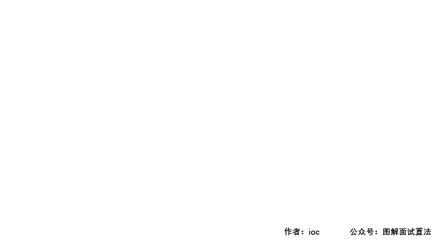

## LeetCode Issue No. 1054: Barcodes with equal distances

> This article was first published on the public account "Illustrated Interview Algorithm" and is one of the series of articles [Illustrated LeetCode](<https://github.com/MisterBooo/LeetCodeAnimation>).
>
> Synchronize personal blog: www.zhangxiaoshuai.fun

**This question is selected from leetcode question No. 1054, medium level, current pass rate is 33.3%**

**Title description:**

	In a warehouse, there is a row of barcodes, where the i-th barcode is barcodes[i].
	Please rearrange these barcodes so that two adjacent barcodes cannot be equal.
	You can return any answer that satisfies this requirement, and this question is guaranteed to have an answer.
	Example 1:
	Input: [1,1,1,2,2,2]
	Output: [2,1,2,1,2,1]
	
	Example 2:
	Input: [1,1,1,1,2,2,3,3]
	Output: [1,3,1,3,2,1,2,1]
	
	hint:
	    1 <= barcodes.length <= 10000
	    1 <= barcodes[i] <= 10000 
### Question analysis:
	1. First we need to record each barcode and the number of times it appears. For the convenience of access, we use an array (the maximum and minimum length of the array has been given in the question) to operate;
	2. Find the barcode that appears the most times and get the barcode and count;
	3. First store the barcode with the most occurrences into the target array (even or odd digits), and update the record array;
	4. Then fill the remaining barcode into the target array.

### GIF animation display:



### Code:

```java
public static int[] rearrangeBarcodes(int[] barcodes){
    int[] address = new int[10001];
    for (int barcode : barcodes)
        address[barcode]++;
    // Find the barcode with the most occurrences
    int maxCode = 0, maxCount = 0;
    for (int i = 0; i < address.length; i++) {
        if (maxCount < address[i]) {
            maxCode = i;
            maxCount = address[i];
        }
    }
    int index = 0;
    // Fill in the largest barcode first
    for (; address[maxCode] > 0; index += 2) {
        barcodes[index] = maxCode;
        address[maxCode]--;
    }
    // Continue to fill in the remaining barcodes
    for (int i = 1; i < address.length; i++) {
        while (address[i] > 0) {
	//The even digits are filled
            if (index >= barcodes.length) index = 1;
            barcodes[index] = i;
            address[i]--;
            index += 2;
        }
    }
    return barcodes;
}
```